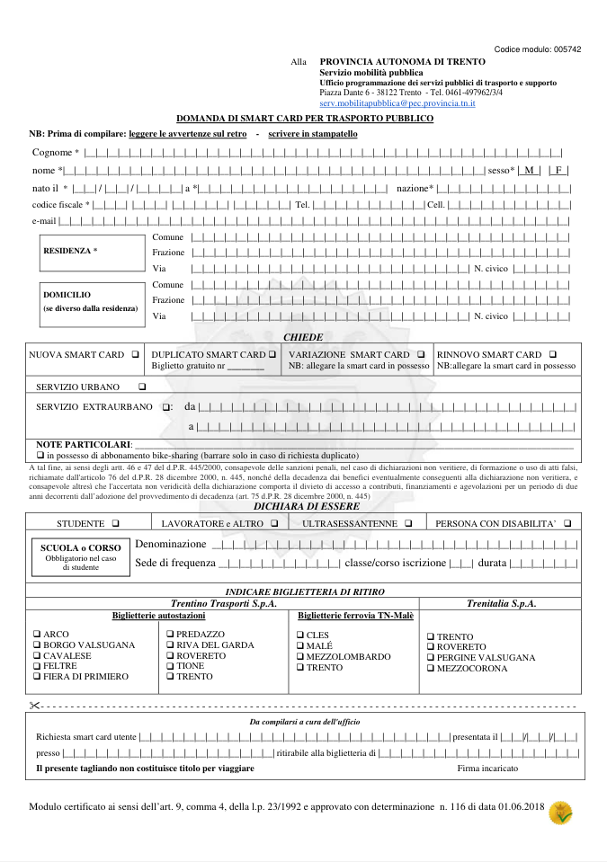
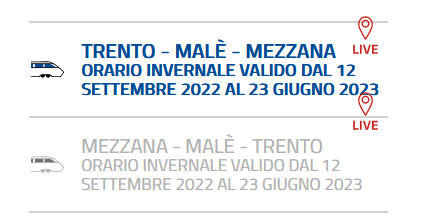
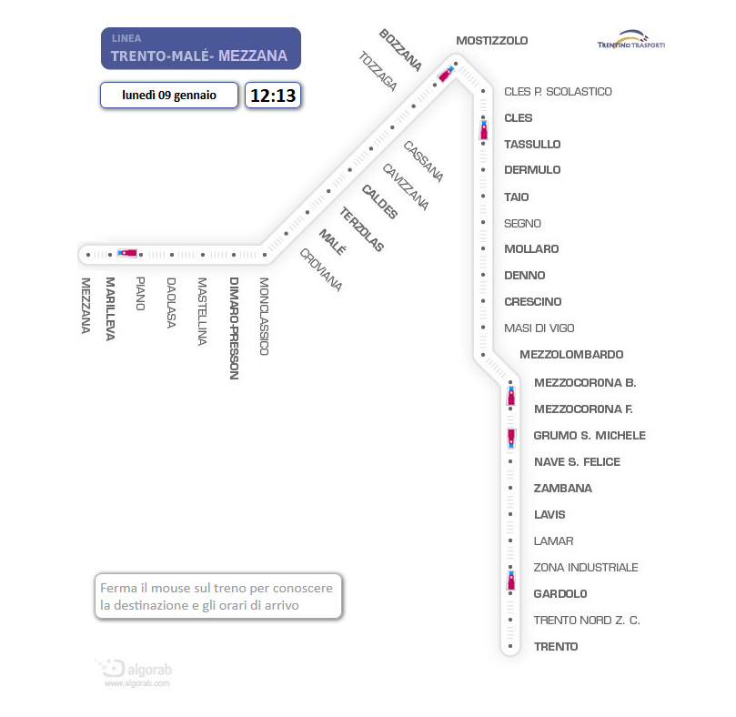
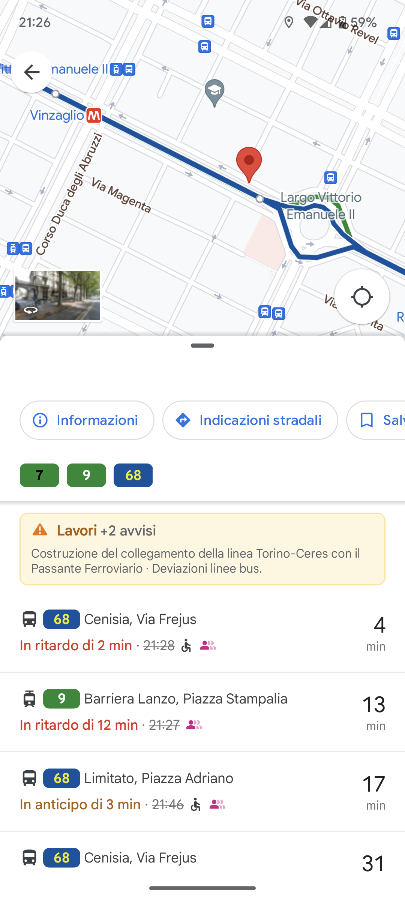
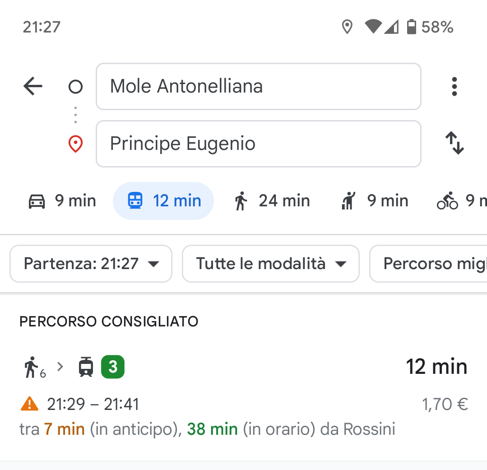

**Trentino Trasporti** è l'azienda che gestisce il trasporto pubblico nella provincia autonoma di Trento. Sulla carta sembra messa bene in quanto a tecnologie innovative e digitalizzazione, ma nella pratica fallisce miseramente. Preparate i popcorn.

***Nota:** questo articolo contiene diverse informazioni tecniche che potrebbero non essere comprensibili per tutti. Il senso generale dovrebbe comunque essere comprensibile anche saltando le parti più tecniche.*

## Open data

Partiamo dai dati sulle linee e sugli orari. Sono pubblicati in formato *General Transit Feed Specification* (**GTFS**) da molti anni sul sito ufficiale, in modo che chiunque possa scaricarli ed utilizzari per realizzare ad esempio delle applicazioni per consultare gli orari.

I dati sono pubblicati in due file ZIP, uno per l'urbano e uno per l'extraurbano. Bello, ma ci sono dei problemi:

- I dati possono essere **aggiornati senza preavviso** e non c'è mai un'indicazione di cosa è cambiato. Non ci si può nemmeno fidare che vengano in qualche modo validati. Infatti è capitato che venissero pubblicato degli orari "vuoti". È capitato anche che i dati scadessero di validità e non venissero aggiornati se non in seguito a una segnalazione. È capitato anche che la data di aggiornamento fosse errata di qualche mese.

- I dati del trasporto urbano in realtà contengono solo l'urbano di Trento e di Rovereto, seppur il trasporto urbano sia presente anche in altre città. Non solo, **i dati per Trento e Rovereto sono mischiati** per cui non è possibile filtrare in modo facile o affidabile la città, se non implementando filtri acrobatici basati sulle coordinate o altro.

- Alcune linee non hanno il **colore della linea** correttamente impostato, mancanza che poi di fatto si riflette in tutte le applicazioni che usano i dati, a meno di patch precarie e inaffidabili.

- I **nomi delle fermate** sono un colabrodo di inconsistenza. Ad esempio:
  - esistono sia `Asiago S.Bartolameo` che `Asiago S. Bartolameo` (lo spazio viene a volte usato per distinguere le fermate sui due lati della strada, sì, sul serio)
  - la fermata di capolinea è a volte `Capolinea` e a volte `Cap.`
  - la direzione "est" è a volte `Est` e a volte `E.`
  - i nomi sono abbreviati con creatività come in `Trento-Autostaz.`, rendendo molto difficile farci affidamento ad esempio per una funzione di ricerca. Una ricerca per `stazione` non ritornerebbe l'autostazione di Trento...

- I **codici fermata** sono... creativi. Sono di solito composti da un numero seguito da una lettera con un significato tutto da decifrare.
  - Ad esempio, `21754z` significa che la fermata porta in direzione "periferia", per via della `z`.
  - La `x` indicherebbe invece direzione "centro", mentre `c` capolinea. In alcuni casi però c'è `n` per nord, `o` per ovest, e così via.
  - In altri casi c'è il segno `-`, che indica che la fermata non ha una controparte sull'altro lato della strada.
  - A volte ci sono delle variazioni non ben definite, non poteva essere così "semplice" ovviamente.
  - Ah, queste regole valgono solo per le fermate urbane, sull'extraurbano è tutta un'altra storia ed è ancora più incoerente. Ad esempio la fermata `Predazzo-Borgo Nuovo` ha codice `1220BN`, dove `BN` sono le iniziali di `Borgo Nuovo`. Ok.
  - Ovviamente tutto ciò non è documentato e non fa parte di nessuno standard, è creatività trentina DOP che si può comprendere solo dopo ore di osservazione manuale dei dati.

- In alcuni casi sarebbe utile **raggruppare le fermate** che in realtà sono "la stessa fermata" ma sui due lati della strada.
  - L'unico modo per farlo è prendere la parte numerica del codice fermata e sperare che corrisponda sempre con la fermata sull'altro lato.
  - A questo punto sorgono comunque altri problemi perché le fermate sui lati opposti non sempre hanno lo stesso nome, quindi bisogna scegliere in qualche modo che nome dare alla fermata raggruppata...

- Il formato GTFS prevede anche la possibilità di definire le **tariffe dei biglietti**. Per qualche motivo questi dati non sono inseriti negli ZIP GTFS presenti sul sito Trentino Trasporti ma sono pubblicati su un [portale separato](https://dati.trentino.it/dataset/trasporti-pubblici-del-trentino-formato-gtfs) (Opendata Trentino), in file separati. Grazie a questo spezzettamento dei dati le applicazioni come Google Maps non acquisiscono i dati sulle tariffe e non possono mostrarle agli utenti quando calcolano i percorsi. Ottimo lavoro.

I **dati in tempo reale** su posizione e ritardi degli autobus esistono nei sistemi di Trentino Trasporti ma non vengono resi pubblici come open data. Si potrebbe usare il formato GTFS Realtime, pensato appositamente per questo tipo di dati. Permetterebbe ad app come Google Maps e Moovit di mostrare tempi di attesa basati su dati reali in tempo reale, offrendo un servizio migliore per tutti. E invece.

## Muoversi in Trentino

*Questa sezione è stata rimossa.*

## OpenMove

*Questa sezione è stata rimossa.*

## Gli abbonamenti

Abbiamo parlato dei biglietti, che si possono acquistare o validare tramite OpenMove. In realtà da qualche anno ci sono anche altre app (meno conosciute), come DropTicket, ma non le ho mai provate direttamente e comunque credo usino gli stessi metodi di validazione.

Per gli **abbonamenti**, escluso quello per gli studenti dell'Università di Trento, siamo purtroppo fermi al Novecento.

Bisogna richiedere la **smart card**, cioè una tessera RFID (e questo va benissimo, per carità, dato che funziona meglio delle app), ma **per ottenerla bisogna compilare un modulo di quattro pagine**. **Cartaceo**. Da consegnare **a mano** nelle biglietterie.

Il modulo è questo:

Mi chiedo se qualcuno in provincia abbia mai provato a compilarlo e si sia reso conto di quanto sia estremamente scomodo scrivere all'interno di quei quadratini. Evidentemente no. Notare anche la filigrana con il logo della provincia di Trento al centro della pagina. Un'opera d'arte.

La *smart card* per gli studenti **scade periodicamente** (il sito Trentino Trasporti dice dopo un anno, ma nel mio caso è sempre stato due anni). Dopodiché ne va richiesta una nuova usando il modulo qua sopra. Perché bisogna rifare la tessera in continuazione invece che usare sempre la stessa? Boh...

Comunque, le **tariffe** dell'abbonamento sono indicate [sul sito Trentino Trasporti](https://www.trentinotrasporti.it/tariffe/abbonamenti/abbonamento-lavoratori), solo che sono contenute in una **tabella JPEG con il testo in Comic Sans**. Non serve nemmeno sforzarsi, si memano da soli. Per l'urbano il prezzo è fisso mentre per l'extraurbano dipende dalla lunghezza in km della tratta che si sceglie. Credo. Non è spiegato.

Esiste anche la carta a scalare ricaricabile, dove ad ogni viaggio viene scalato il costo del biglietto. Anche questa si può richiedere solo nelle biglietterie e ricaricata praticamente solo lì.

(L'ultima volta che sono stato in una biglietteria, un paio di anni fa, **sui computer avevano ancora Windows XP**. Il cui supporto è terminato nel 2014, sì.)

Non serve andare troppo lontano per capire come si poteva invece fare: in **provincia di Bolzano** esiste sostanzialmente un solo tipo di abbonamento, l'**AltoAdige Pass**:

- Si richiede esclusivamente online, anche con SPID.
- Si riceve la tessera per posta.
- Non bisogna scegliere nessuna tratta, si paga al km di viaggio e più si viaggia meno si paga. Sopra un certo numero di km si smette di pagare, così diventa sostanzialmente un abbonamento a costo fisso.
- La tessera può essere ricaricabile (pre-paid) oppure post-paid: nel primo caso si può ricaricare online tramite una qualsiasi carta di debito, nel secondo caso l'importo speso viene periodicamente addebitato direttamente sul conto corrente (SDD) in base a quanto si è viaggiato.

Biglietti e abbonamenti si possono acquistare e validare anche tramite l'app *altoadigemobilità*, unica e ufficiale. Non l'ho mai provata quindi non posso commentare sulla qualità.

## Treni

Con Trenitalia siamo abituati ad avere i ritardi in tempo reale dei treni pubblicati online. Trentino Trasporti, beh...

Trentino Trasporti gestisce la **Ferrovia Trento-Malé-Mezzana** (FTM per gli amici), quindi sia l'infrastruttura che i treni, e anche parte del servizio ferroviario sulla ferrovia **Trento-Bassano del Grappa** (gestita da RFI).

Nel secondo caso facciamo presto: **Trentino Trasporti non pubblica i dati in tempo reale** sulla posizione o sui ritardi dei treni sulla ferrovia Trento-Bassano. Solo sul sito RFI è possibile consultare i tabelloni delle stazioni/fermate, dove sono indicati anche i treni TT, ma la granularità è di 5 minuti e in generale non sembra particolarmente affidabile (ad esempio spesso spariscono i dettagli del treno come il fatto che i treni possono essere sostituiti da bus). Non è nemmeno possibile cercare un treno specifico.

Per quanto riguarda la **FTM** sono effettivamente presenti dei dati in tempo reale: bisogna premere quel tasto **"LIVE"** sul sito Trentino Trasporti. È un po' per aria da qualche anno, non se ne sono ancora accorti. Si finisce su un altro capolavoro, la [*train view*](http://trainview.algorab.net/).

Tanto per cambiare, **è un colabrodo**. Funziona anche ma ha un layout molto particolare e sembra più un giocattolo per vedere dove sono i treni più che qualcosa di utile per capire tra quanto arriva il treno a cui si è interessati. A volte i treni smettono di "aggiornarsi" per qualche motivo e non è indicato da nessuna parte che i dati potrebbero non essere aggiornati. Per un'analisi tecnica del perché non si salva nulla di questo strumento, [qua](https://youtu.be/IgBRGQdQlLQ) c'è un mio video su YouTube.

## Come si poteva fare

Si poteva provare ad avere una reale **visione di come sfruttare la tecnologia per migliorare il modo in cui le persone usano il trasporto pubblico**.

E direi che far uscire un'app all'anno mentre ci sono ancora i moduli cartacei per fare gli abbonamenti non fa parte di alcuna visione.

Non serve comunque essere massimi esperti di innovazione per capire quando una strategia ha senso oppure no. Si può anche copiare (prendere spunto) da chi le cose le sta già facendo bene.

Seguono idee sparse.
- **I dati in tempo reale dovrebbero essere aperti**. Non c'è motivo per cui non debbano esserlo. Si potrebbe usare il formato GTFS Realtime, in modo che i dati possano essere importati automaticamente in Google Maps, Moovit, ecc.
  - Alcune aziende di trasporti in Italia già lo fanno, come GTT a Torino.
  - Il vantaggio è che quando si cerca un percorso in Google Maps questo tiene in considerazione i ritardi reali dei mezzi.
  - Non solo, il formato GTFS Realtime consente anche di comunicare avvisi a livello di linea o di fermata, ad esempio in caso di deviazioni temporanee.
  - È chiaro invece che farsi la propria app che funziona male (e che poi usa comunque le API di Google Maps) è una strategia fallimentare.
  - Che piaccia o no, **gli utenti già usano app come Google Maps** e un'azienda di trasporti **non può ignorarlo** e mettersi a reinventare la ruota facendola quadrata.
  - Seguono screenshot di Google Maps a Torino con i ritardi reali dei mezzi.

- Una volta pubblicati i dati, **non ci sarebbe nemmeno bisogno di sviluppare un'applicazione dedicata**. Si spende di meno e si ottiene un'esperienza di gran lunga superiore. Non piace Google Maps? Va bene, ci sono altre applicazioni che si possono promuovere, probabilmente anche "open". Ma non mi sembra comunque questo il problema visto che Google Maps è indicata letteralmente come prima cosa sulla homepage del sito Trentino Trasporti.
- I **codici fermata** potrebbero essere assegnati con un criterio più sensato ed essere così esposti chiaramente alle fermate. Ho sviluppato il sito web [Tra quanto passa](https://traquantopassa.in/) come alternativa a Muoversi in Trentino e se il codice fermata fosse indicato non in miniatura alle fermate potrebbe essere utilizzato per accedere velocemente a un fermata specifica e vedere quali corse passeranno nei prossimi minuti.
- Il **sistema di abbonamenti** andrebbe rivisto in ottica 2023 e reso più moderno. Alla fine basta copiare qualche idea dall'Alto Adige.
  - Tutti gli abbonamenti potrebbero (opzionalmente) essere digitali, mantenendo la **validazione tramite smartphone**: immaginate di poter avvicinare lo smartphone al **tag NFC**, avviando così all'istante l'app di validazione. **Niente splash screen, niente attese, niente conferme**. Potrebbe persino funzionare **offline** e sincronizzarsi in un secondo momento!
- Tutto il sistema di *mobile ticketing* potrebbe essere direttamente sostituito dal **pagamento contactless con carta di debito o smartphone (Google/Apple Pay) a bordo**.
  - Il punto è questo: **perché dovrei scaricare un'app**, fare un account, acquistare il biglietto inserendo i dati della carta, andare sull'autobus e incrociare le dita che l'app funzioni per poi inserire codici o altro per completare la validazione? 
  - L'acquisto e validazione del biglietto tramite pagamento contactless sarebbe **infinitamente più veloce e comodo** e garantirebbe anche che si paghi sempre la tariffa più conveniente, in automatico.
  - In molte città è già presente, anche se non sempre su tutte le linee e i mezzi: è presente ad esempio sui mezzi ATAC (Roma), GTT (Torino), ATM (Milano), Tper (Bologna, Ferrara, Imola), ATAF (Firenze, finché non è cambiata gestione), ATB (Bergamo), Trieste Trasporti e altri. Si [aggiungerà](https://www.rainews.it/tgr/bolzano/video/2023/01/rivoluzione-per-la-mobilit-altoatesina--ecco-le-novit-digitali-in-arrivo-per-chi-viaggia--8d2df5c2-c169-4cf4-83b6-f90f5831f706.html) a breve anche l'Alto Adige.
- Ciò non toglie che possano esserci dei benefici ad avere **un'app ufficiale** dove si possano acquistare i biglietti e gestire gli abbonamenti. Anche in questo caso in realtà basterebbe prendere spunto dagli altri.
  - **Qual è il senso di avere quattro app in concorrenza** tra loro (se ne aggiunge una all'anno praticamente)?
  - Non avrebbe più senso investire seriamente in dei servizi online di qualità, senza spezzettare tutto?
  - *...rimosso...*
  - Un'app per il trasporto pubblico ha bisogno di una accurata progettazione soprattutto in termini di UX e di una continua cura per adattarsi alle esigenze degli utenti.
  - Deve tra l'altro (secondo me) essere un'app nativa. Deve avviarsi istantaneamente, perché l'utente alla fermata non ha tempo da perdere e vuole che l'app funzioni sempre, velocemente e nel modo più fluido possibile. Le app ibride raramente riescono a raggiungere le prestazioni delle app native.
  - Se fai un'app per il trasporto pubblico, ***deve* funzionare bene come Google Maps**. Se pensi di facerla, bene, I'm in. Altrimenti puoi stare certo che la gente se ne accorgerà e avrai buttato soldi. Ma soprattutto, dovresti accorgertene da solo.
  - *...rimosso...*
