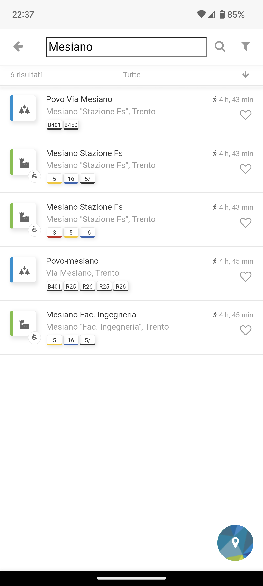
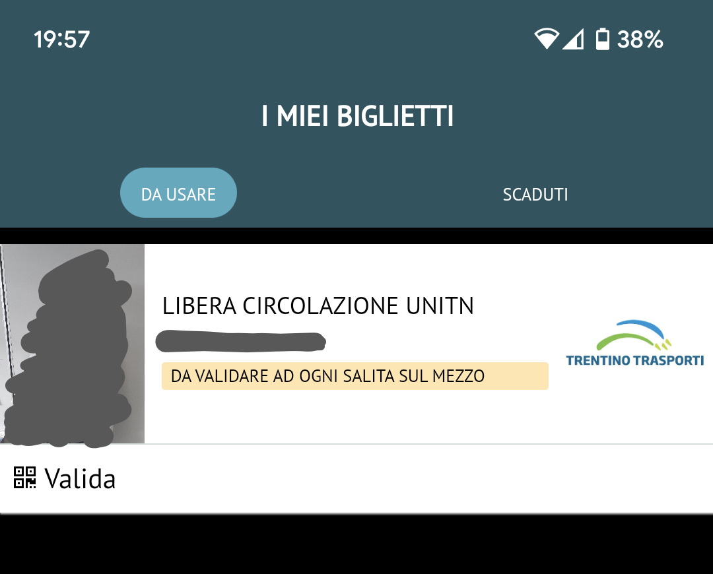
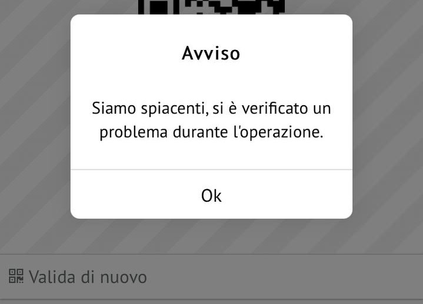
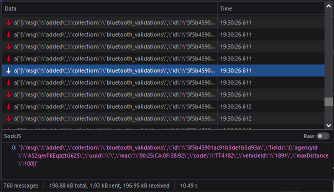

**Trentino Trasporti** è l'azienda che gestisce il trasporto pubblico nella provincia autonoma di Trento. Sulla carta sembra messa bene in quanto a tecnologie innovative e digitalizzazione, ma nella pratica fallisce miseramente. Preparate i popcorn.

***Nota:** questo articolo contiene diverse informazioni tecniche che potrebbero non essere comprensibili per tutti. Il senso generale dovrebbe comunque essere comprensibile anche saltando le parti più tecniche.*

## Open data

Partiamo dai dati sulle linee e sugli orari. Sono pubblicati in formato *General Transit Feed Specification* (**GTFS**) da molti anni sul sito ufficiale, in modo che chiunque possa scaricarli ed utilizzari per realizzare ad esempio delle applicazioni per consultare gli orari.

I dati sono pubblicati in due file ZIP, uno per l'urbano e uno per l'extraurbano. Bello, ma ci sono dei problemi:

- I dati possono essere **aggiornati senza preavviso** e non c'è mai un'indicazione di cosa è cambiato. Non ci si può nemmeno fidare che vengano in qualche modo validati. Infatti è capitato che venissero pubblicato degli orari "vuoti". È capitato anche che i dati scadessero di validità e non venissero aggiornati se non in seguito a una segnalazione. È capitato anche che la data di aggiornamento fosse errata di qualche mese.

- I dati del trasporto urbano in realtà contengono solo l'urbano di Trento e di Rovereto, seppur il trasporto urbano sia presente anche in altre città. Non solo, **i dati per Trento e Rovereto sono mischiati** per cui non è possibile filtrare in modo facile o affidabile la città, se non implementando filtri acrobatici basati sulle coordinate o altro.

- Alcune linee non hanno il **colore della linea** correttamente impostato, mancanza che poi di fatto si riflette in tutte le applicazioni che usano i dati, a meno di patch precarie e inaffidabili.

- I **nomi delle fermate** sono un colabrodo di inconsistenza. Ad esempio:
  - esistono sia `Asiago S.Bartolameo` che `Asiago S. Bartolameo` (lo spazio viene a volte usato per distinguere le fermate sui due lati della strada, sì, sul serio)
  - la fermata di capolinea è a volte `Capolinea` e a volte `Cap.`
  - la direzione "est" è a volte `Est` e a volte `E.`
  - i nomi sono abbreviati con creatività come in `Trento-Autostaz.`, rendendo molto difficile farci affidamento ad esempio per una funzione di ricerca. Una ricerca per `stazione` non ritornerebbe l'autostazione di Trento...

- I **codici fermata** sono... creativi. Sono di solito composti da un numero seguito da una lettera con un significato tutto da decifrare.
  - Ad esempio, `21754z` significa che la fermata porta in direzione "periferia", per via della `z`.
  - La `x` indicherebbe invece direzione "centro", mentre `c` capolinea. In alcuni casi però c'è `n` per nord, `o` per ovest, e così via.
  - In altri casi c'è il segno `-`, che indica che la fermata non ha una controparte sull'altro lato della strada.
  - A volte ci sono delle variazioni non ben definite, non poteva essere così "semplice" ovviamente.
  - Ah, queste regole valgono solo per le fermate urbane, sull'extraurbano è tutta un'altra storia ed è ancora più incoerente. Ad esempio la fermata `Predazzo-Borgo Nuovo` ha codice `1220BN`, dove `BN` sono le iniziali di `Borgo Nuovo`. Ok.
  - Ovviamente tutto ciò non è documentato e non fa parte di nessuno standard, è creatività trentina DOP che si può comprendere solo dopo ore di osservazione manuale dei dati.

- In alcuni casi sarebbe utile **raggruppare le fermate** che in realtà sono "la stessa fermata" ma sui due lati della strada.
  - L'unico modo per farlo è prendere la parte numerica del codice fermata e sperare che corrisponda sempre con la fermata sull'altro lato.
  - A questo punto sorgono comunque altri problemi perché le fermate sui lati opposti non sempre hanno lo stesso nome, quindi bisogna scegliere in qualche modo che nome dare alla fermata raggruppata...

- Il formato GTFS prevede anche la possibilità di definire le **tariffe dei biglietti**. Per qualche motivo questi dati non sono inseriti negli ZIP GTFS presenti sul sito Trentino Trasporti ma sono pubblicati su un [portale separato](https://dati.trentino.it/dataset/trasporti-pubblici-del-trentino-formato-gtfs) (Opendata Trentino), in file separati. Grazie a questo spezzettamento dei dati le applicazioni come Google Maps non acquisiscono i dati sulle tariffe e non possono mostrarle agli utenti quando calcolano i percorsi. Ottimo lavoro.

I **dati in tempo reale** su posizione e ritardi degli autobus esistono nei sistemi di Trentino Trasporti ma non vengono resi pubblici come open data. Si potrebbe usare il formato GTFS Realtime, pensato appositamente per questo tipo di dati. Permetterebbe ad app come Google Maps e Moovit di mostrare tempi di attesa basati su dati reali in tempo reale, offrendo un servizio migliore per tutti. E invece.

## Muoversi in Trentino

Oh boy, da dove cominciamo. **Muoversi in Trentino** è l'app ufficiale della provincia di Trento per **consultare gli orari dei trasporti pubblici** nella provincia. Permette anche di vedere i **dati in tempo reale**, cioè il ritardo effettivo degli autobus. Quando funziona, s'intende.

Una versione sperimentale dell'app è stata messa a disposizione di un gruppo non ben precisato di persone a giugno 2019. La versione iniziale è stata pubblicata a gennaio 2020, dopo circa sei mesi di test in cui letteralmente tutti i feedback sono stati completamente ignorati.

È un'app **ibrida, lenta, progettata e realizzata male**. Non voglio nemmeno sapere quanto la società **AlamvivA** è stata pagata per concepirla perché in ogni caso sarebbe troppo.

Iniziamo dal fatto che una volta aperta l'app si presenta con un messaggio che dice `stringhe.stringa__reteConnessa`, sempre. (Vedi video sotto.)

Poi, l'ultima volta che ho controllato **ad ogni avvio l'app scaricava l'intera lista di fermate** del Trentino. Sono 2,28 Megabyte e non viene applicata nessuna compressione nemmeno a livello HTTP. Capita quindi spesso che l'app resti lì qualche secondo a caricare le fermate, visto che il server non risponde prima di due secondi. Tra l'altro le fermate non è che cambiano ogni giorno, serve scaricarle ogni volta?

C'è una sezione con la **mappa delle fermate**, che però è tutto un lag persino su un telefono di punta come il Pixel 6. A volte le fermate sono sovrapposte quindi per trovare quella giusta bisogna zoomare, troppo. A volte le coordinate delle fermate non sono molto precise quindi non si capisce su quale lato della strada siano. Ovviamente il nome della fermata non aiuta a capire, perché è quasi sempre identico. Il codice fermata non è indicato.

<video controls style="width: 50%">
    <source src="mit-1.mp4" type="video/mp4">
</video>

<!-- ffmpeg -ss 2 -i screen-20230109-132529.mp4 -t 45 -an -map_metadata -1 mit-1.mp4 -y -->

Una volta aperto il campo di ricerca sulla mappa non ci si può più uscire perché qualunque spostamento riapre la tastiera. **Una ricerca per "stazione" mostra 5 risultati e nemmeno uno è in provincia di Trento.** Straordinario.

Su iOS, quando si apre una fermata cliccandoci sopra e poi si torna indietro, **il centro della mappa viene sempre riportato alla posizione attuale**, rendendo abbastanza scomodo navigare la mappa. Ma solo su iOS, su Android non lo fa. Sia mai che ci sia della coerenza.

Mentre testavo l'app per scrivere questo articolo, **non funzionava**. Succede spesso, almeno una volta alla settimana. Si rompe tutto e l'app non riesce a caricare i dati. Nel giorno in cui ho registrato il seguente video l'app è stata offline per circa tre ore. Ovviamente in questi casi c'è sempre il rischio che l'app si disintegri da sola e non si riprenda più.
<video controls style="width: 50%">
    <source src="mit-2.mp4" type="video/mp4">
</video>

<!-- ffmpeg -ss 12 -i screen-20230109-181633.mp4 -an -map_metadata -1 -t 32 mit-2.mp4 -y -->

A volte in realtà succede anche senza fare niente, basta lasciare l'app in background per un po' di tempo e poi riaprirla perché finisca in coma. Qualità.

<video controls style="width: 50%">
    <source src="mit-3.mp4" type="video/mp4">
</video>

<!-- ffmpeg -ss 1 -i screen-20230111-131052.mp4 -an -map_metadata -1 -t 23 mit-3.mp4 -y -->

Passiamo alla lista delle linee degli autobus. Alcune non hanno il colore, vi ricorda qualcosa?

All'interno di ciascuna linea si possono vedere le **corse degli autobus per quella linea**, una per "pagina", ma non c'è modo di filtrare una direzione specifica quindi trovare la corsa giusta può essere lungo. La navigazione tra le diverse corse è **un capolavoro di fluidità**: a volte non si capisce se la pagina è effettivamente cambiata perché non ci sono animazioni.

Sulle corse sono indicati gli orari con i **ritardi in tempo reale** degli autobus. Quando funzionano, s'intende, visto che ogni tanto spariscono i dati e tornano dopo qualche ora o il giorno dopo.

Comunque, anche il modo in cui vengono presentati i ritardi è un grande pasticcio:

- ad esempio, quando un autobus arriva al capolinea il ritardo si azzera, sempre, quindi gli autobus risultano tutti arrivati in orario. Ok.
- se un autobus resta fermo tra due fermate (es. traffico, incidente), il sistema prende per buono l'ultimo ritardo trasmesso (alla fermata precedente) e l'app non te lo fa sapere.
- in generale, se un autobus ha smesso di trasmettere dati anche mezz'ora fa l'app non te lo dice e prende per buono l'ultimo ritardo trasmesso, anche se ovviamente non è più attuale.
- se una corsa deve ancora partire perché ferma al capolinea viene indicata come "in orario", anche nei casi in cui in realtà non lo è.
- se una corsa deve ancora partire e l'autobus sta ancora svolgendo la corsa precedente il sistema non collega le due cose e ti dice che le informazioni in tempo reale non sono disponibili. Sulle linee che in certe fasce orarie accumulano ritardi anche di mezz'ora i dati diventano quindi sostanzialmente inutili.

C'è anche una sezione "fermate" che dà le informazioni su tutte le corse che passeranno da ciascuna fermata. Il problema è capire **qual è la fermata giusta**. Ad esempio, se cerco `mesiano` e riesco a superare indenne i glitch dell'app che ogni tanto fanno **sparire le fermate dalla lista**, non ho un modo per capire su quale delle due "Mesiano Stazione Fs" devo premere, perché hanno lo stesso nome. Devo andare a tentativi oppure ricordami quali linee passano su quale lato e scegliere in base a quello. A volte sembra appositamente progettata per renderti la vita difficile.

(L'app dice 6 risultati, ma quanti ne vedete voi?)

Ah, poi c'è anche una sezione **Pianifica** che è praticamente un clone di Google Maps (di cui usa le API) ma dieci volte peggio. Guardate. Ma cos'è?

Per completare dovremmo parlare anche della mostruosità delle **API** su cui l'app si basa, ma ci vorrebbe un articolo dedicato. Vi basti sapere che il campo JSON con l'orario stimato di arrivo di una corsa si chiama `oraArrivoEffettivaAFermataSelezionata`, mentre l'orario di ultimo aggiornamento dei dati si chiama `lastEventRecivedAt` (typo incluso). Lascio `lastSequenceDetection` come esercizio per casa.

Bonus: nelle impostazioni si può abilitare il **"filtro accessibilità"**, che presumo dovrebbe servire per rendere l'app meglio integrata con gli screen reader come TalkBack di Android. Non si sa perché dovrebbe essere un'opzione ma **non mi risulta faccia nulla**. TalkBack funziona malissimo in entrambi i casi anche perché **legge il testo in italiano come se fosse in inglese**. Con il telefono configurato in italiano. Sul serio.

Non si salva molto. È tutto così da più di tre anni e non è cambiato niente. Un'occasione sprecata. Ma chi l'avrebbe mai detto, di solito le app pubbliche sono fatte così bene.

## OpenMove

Ma le app "private" funzionano meglio, no?

<video autoplay muted loop playsinline style="width: 60%; margin-left: 0">
    <source src="https://thumbs.gfycat.com/AbandonedAggravatingBoilweevil-mobile.mp4" type="video/mp4">
</video>

**OpenMove** è l'app di *mobile ticketing* inizialmente integrata con Trentino Trasporti nel 2015. Dal 2017 viene usata anche per la validazione degli abbonamenti libera circolazione riservati agli studenti dell'Università di Trento.

Dall'app si possono quindi **validare questi abbonamenti** quando si sale sull'autobus oppure **acquistare e validare i biglietti** con le stesse modalità. (Ci sono anche altre app per l'acquisto dei biglietti ma OpenMove è di gran lunga la più promossa e nota.)

Non lo so, da dove cominciamo? Magari dal fatto che spesso **ci sono [giornate intere](https://www.instagram.com/p/CnKAKozDrmI/) in cui l'app non funziona del tutto**. Per OpenMove è sempre colpa delle reti mobili (basta leggere le risposte alle recensioni) ma in realtà a volte è semplicemente rotta. E quando è rotta ti tocca pagare il biglietto a bordo, anche se l'hai già comprato e anche se hai l'abbonamento.

OpenMove è un'applicazione web realizzata con il framework Meteor (che andava di moda più o meno nel 2012). L'applicazione web è stata poi "wrappata" in un'app Android/iOS con l'aiuto di Cordova e pubblicata sugli store.

Tutta **la trasmissione dei dati avviene tramite WebSockets**. Mi sfugge il senso, ma ok. Quando esegui un'azione nell'app il comando viene inviato al server e viene poi attesa la risposta. **A volte la risposta non arriva mai** o arriva dopo diversi minuti (sul serio). In questi casi l'app sta semplicemente lì ad aspettare, con l'icona di caricamento, senza nessun timeout né altro avviso. È stupendo.

Che cosa succede se l'applicazione non riesce a (ri)connettersi al WebSocket? Ma niente, naturalmente. Solo una rotella di caricamento che a volte resta all'infinito, a volte sparisce dopo un po'. A volte compare un messaggio che dice "OpenMove non è ancora sbarcata qui!". Boh. La gestione degli errori pare essere inesistente.

Per la cronaca, lo **"Stato servizio"** nelle impostazioni dell'app **è sempre "Online" anche quando non va niente**, ma un modo per vedere quando qualcosa non va è guardare nella pagina profilo la voce "Statistiche", dove viene indicato "#undefined" quando non riesce a caricare qualcosa.

Sta per peggiorare: **il server comunica al client l'orario attuale letteralmente una volta al secondo**, accumulando diversi kB di dati trasferiti per ogni minuto che l'applicazione è aperta. Un capolavoro, non c'è che dire, io non ci sarei mai arrivato. E per fortuna che è un'app che dovrebbe essere appositamente progettata per essere usata in mobilità, dove è importantissimo ottimizzare il consumo di dati e in generale le prestazioni.

Parliamo di cose più serie, come la **sicurezza delle password**: quando si fa il login la password viene trasmessa al server come digest SHA-256, calcolato sul client. Pensavo che non fossimo più nel 2012. Perché questo significa che le password sono salvate nel database come hash SHA-256, senza salt e senza alcuna protezione contro le rainbow table. È un **design fragile e superato da tempo**, e direi che non è sicuramente una buona strategia farlo sapere al mondo così.

Passiamo alla **validazione dei biglietti e degli abbonamenti**. Datemi la forza. Le modalità di validazione sono quattro: codice QR, NFC, Bluetooth, codice inserito a mano. Per arrivarci bisogna premere il pulsante **Valida** su un biglietto o sull'abbonamento. No, scusate, non è un pulsante: bisogna letteralmente premere sul testo "Valida", che è minuscolo rispetto all'ampio spazio disponibile sulla pagina. Un pixel più in là e non funziona.

A parte questo, alcune osservazioni sulle modalità di validazione:

- la **scansione dei QR** (esposti all'interno di tutti gli autobus) è atroce, lenta e imprecisa. Basta provarla qualche volta sul campo, quindi su un autobus dove c'è in genere poca stabilità e una luminosità variabile per capire che non va bene (almeno su Android).
  - Pare che l'app usi il plugin Cordova `phonegap-plugin-barcodescanner`, che non viene aggiornato dal 2018 e credo si basi quindi su una versione antiquata di Zxing, storica libreria per la scansione di codici a barre e matrici.
  - Nel frattempo però il mondo è andato avanti e basterebbe sfruttare ML Kit di Google per migliorare significativamente la velocità e affidabilità della scansione dei QR.
  - Per la cronaca il QR non contiene soltanto il codice del mezzo ma un URL lunghissimo, aumentando così la complessità di scansione del QR. Più precisamente il contenuto del QR è ad esempio `https://www.trentinotrasporti.it/applist.html?partner=TT&id=5669`. Questo URL se aperto direttamente porta a una pagina con la lista delle app ma non permette di fare altro.
  - Come si poteva fare: 1) inserire solo il codice del mezzo nel QR, oppure 2) fare in modo che il QR porti a una pagina dove quantomeno si può aprire direttamente l'app e validare. Con un redirect verso un'applicazione web si potrebbe addirittura fare la validazione interamente nel browser, senza installare nessuna app.
- la **validazione con NFC** è una contorsione unica, ci vorrebbe quasi un premio. Per validare l'abbonamento o il biglietto con NFC bisogna: aprire l'app, aprire il menù di validazione, scegliere NFC e quindi appoggiare il telefono al tag NFC che si trova "sotto" il QR.
  - A volte sugli autobus o alle fermate non è presente il tag NFC. Questo però non si può sapere in anticipo (credo), quindi bisogna provare e se poi non funziona tornare indietro e selezionare un'altra modalità di validazione 🤦‍♂️. Uno dei motivi per cui non ho mai visto una sola persona usare l'NFC per validare.
  - Come si poteva invece fare: si poteva inserire un intent/URI all'interno del tag NFC, in modo che semplicemente appoggiando il telefono al tag si avviasse la validazione. Senza aprire l'app a mano, senza diciotto tap e senza aspettare che l'interminabile splash screen termini di fare non si sa cosa per diversi secondi.
- il pulsante per **validare tramite Bluetooth** è stato aggiunto a gennaio 2023 ma non funziona. Se si preme il tasto viene mostrato immediatamente un errore. Fantastico.

  - La validazione Bluetooth funziona riconoscendo il sistema di bordo degli autobus (e quindi l'autobus su cui ci si trova) tramite il *MAC address*. Come fa l'app a sapere a quale autobus corrisponde un indirizzo MAC? Wait for it... **Ogni volta che si apre l'app viene scaricata la lista degli indirizzi MAC di tutti i 700+ autobus** di Trentino Trasporti. **Ogni volta**. **Tutti e 700**. Anche se non si è fatto il login, anche se non si è in Trentino. Sono **200 kB di dati**, ogni volta.

  - *Nota: questa analisi è stata svolta nella web app, da un computer. È possibile che l'app funzioni in qualche modo diversamente su mobile.*
- in alternativa ai metodi sopra si può anche **inserire a mano un codice**, che è stampato sotto il QR. Non lo so come sia possibile ma persino i campi di testo sono inusabili in questa app. A volte bisogna premere due o tre volte solo perché si apra la tastiera. Ovviamente si può inserire un qualsiasi codice esistente quindi si può validare anche prima di salire sull'autobus, con un codice a caso. Se il codice per la validazione corrispondesse al numero di matricola dell'autobus si potrebbe leggere già fuori dall'autobus, ma non è così.

Per la validazione è **obbligatoria la presenza di una connessione a Internet**. E ci può stare, ma anche dopo aver validato non è possibile vedere niente nell'app se non c'è una connessione dati. Quindi se il controllore vuole vedere che hai validato in un momento in cui non c'è copertura (es. in treno in galleria), niente, non puoi. Persino i controllori consigliano di fare lo screenshot dell'app in un momento in cui per grazia divina l'app funziona.

Un dettaglio a questo punto quasi irrilevante rispetto al resto è che su Android se si preme il **tasto indietro** non si chiude l'app, come avviene in tutte le app del mondo: si ricarica invece la pagina, e non si può uscire.

<video controls style="width: 50%">
    <source src="openmove-1.mp4" type="video/mp4">
</video>

<!-- ffmpeg -i screen-20230112-204803.mp4 -an -map_metadata -1 -t 10 openmove-1.mp4 -y -->

Il sito OpenMove dice che «è stata posta grande cura nella realizzazione dell'app per gli utenti». Pensate se non ci mettevano cura.

<video autoplay muted loop playsinline style="width: 60%; margin-left: 0">
    <source src="https://thumbs.gfycat.com/GloriousMarriedAgama-mobile.mp4" type="video/mp4">
</video>

Ah, il sito dice anche che l'app è integrata con smartwatch e assistenti vocali. Non è vero.

Cosa succede quindi in pratica:

- che [la gente si lamenta](https://www.instagram.com/p/CnKAKozDrmI/), da anni, perché **l'app funziona oggettivamente male**.
- che la gente, o almeno gli studenti universitari, non usa i metodi di validazione con QR o NFC perché **diventa più facile mettere un codice**, anche a caso, va bene uguale.
- che **un sistema pensato per semplificare finisce per diventare una incredibile perdita di tempo, pazienza ed energie per tutti**. Alcune scene viste, vissute o lette nell'ultimo mese:
  - la signora sull'autobus che attende che l'app si riprenda da uno dei suoi caricamenti infiniti. Ci prova diverse volte, periodicamente durante il viaggio. Ma nell'app non esistono i timeout e gli errori non sono contemplati, quindi aspettare non è una soluzione. Ma chi glielo spiega questo?
  - la ragazza che mi fa entrare prima di lei sull'autobus perché deve aspettare che l'app si apra. È ferma sulla splash screen e non succede niente. Il telefono è un iPhone.
  - il gruppetto di 3-4 persone che prova a spiegare all'autista che OpenMove non funziona e che non possono validare l'abbonamento.
  - l'autista che alza la voce e accusa lo studente di non voler pagare il biglietto.

Ma tranquilli, è tutto ok, è solo colpa delle reti.

## Gli abbonamenti

Abbiamo parlato dei biglietti, che si possono acquistare o validare tramite OpenMove. In realtà da qualche anno ci sono anche altre app (meno conosciute), come DropTicket, ma non le ho mai provate direttamente e comunque credo usino gli stessi metodi di validazione.

Per gli **abbonamenti**, escluso quello per gli studenti dell'Università di Trento, siamo purtroppo fermi al Novecento.

Bisogna richiedere la **smart card**, cioè una tessera RFID (e questo va benissimo, per carità, dato che funziona meglio delle app), ma **per ottenerla bisogna compilare un modulo di quattro pagine**. **Cartaceo**. Da consegnare **a mano** nelle biglietterie.

Il modulo è questo:

Mi chiedo se qualcuno in provincia abbia mai provato a compilarlo e si sia reso conto di quanto sia estremamente scomodo scrivere all'interno di quei quadratini. Evidentemente no. Notare anche la filigrana con il logo della provincia di Trento al centro della pagina. Un'opera d'arte.

La *smart card* per gli studenti **scade periodicamente** (il sito Trentino Trasporti dice dopo un anno, ma nel mio caso è sempre stato due anni). Dopodiché ne va richiesta una nuova usando il modulo qua sopra. Perché bisogna rifare la tessera in continuazione invece che usare sempre la stessa? Boh...

Comunque, le **tariffe** dell'abbonamento sono indicate [sul sito Trentino Trasporti](https://www.trentinotrasporti.it/tariffe/abbonamenti/abbonamento-lavoratori), solo che sono contenute in una **tabella JPEG con il testo in Comic Sans**. Non serve nemmeno sforzarsi, si memano da soli. Per l'urbano il prezzo è fisso mentre per l'extraurbano dipende dalla lunghezza in km della tratta che si sceglie. Credo. Non è spiegato.

Esiste anche la carta a scalare ricaricabile, dove ad ogni viaggio viene scalato il costo del biglietto. Anche questa si può richiedere solo nelle biglietterie e ricaricata praticamente solo lì.

(L'ultima volta che sono stato in una biglietteria, un paio di anni fa, **sui computer avevano ancora Windows XP**. Il cui supporto è terminato nel 2014, sì.)

Non serve andare troppo lontano per capire come si poteva invece fare: in **provincia di Bolzano** esiste sostanzialmente un solo tipo di abbonamento, l'**AltoAdige Pass**:

- Si richiede esclusivamente online, anche con SPID.
- Si riceve la tessera per posta.
- Non bisogna scegliere nessuna tratta, si paga al km di viaggio e più si viaggia meno si paga. Sopra un certo numero di km si smette di pagare, così diventa sostanzialmente un abbonamento a costo fisso.
- La tessera può essere ricaricabile (pre-paid) oppure post-paid: nel primo caso si può ricaricare online tramite una qualsiasi carta di debito, nel secondo caso l'importo speso viene periodicamente addebitato direttamente sul conto corrente (SDD) in base a quanto si è viaggiato.

Biglietti e abbonamenti si possono acquistare e validare anche tramite l'app *altoadigemobilità*, unica e ufficiale. Non l'ho mai provata quindi non posso commentare sulla qualità.

## Treni

Con Trenitalia siamo abituati ad avere i ritardi in tempo reale dei treni pubblicati online. Trentino Trasporti, beh...

Trentino Trasporti gestisce la **Ferrovia Trento-Malé-Mezzana** (FTM per gli amici), quindi sia l'infrastruttura che i treni, e anche parte del servizio ferroviario sulla ferrovia **Trento-Bassano del Grappa** (gestita da RFI).

Nel secondo caso facciamo presto: **Trentino Trasporti non pubblica i dati in tempo reale** sulla posizione o sui ritardi dei treni sulla ferrovia Trento-Bassano. Solo sul sito RFI è possibile consultare i tabelloni delle stazioni/fermate, dove sono indicati anche i treni TT, ma la granularità è di 5 minuti e in generale non sembra particolarmente affidabile (ad esempio spesso spariscono i dettagli del treno come il fatto che i treni possono essere sostituiti da bus). Non è nemmeno possibile cercare un treno specifico.

Per quanto riguarda la **FTM** sono effettivamente presenti dei dati in tempo reale: bisogna premere quel tasto **"LIVE"** sul sito Trentino Trasporti. È un po' per aria da qualche anno, non se ne sono ancora accorti. Si finisce su un altro capolavoro, la [*train view*](http://trainview.algorab.net/) "Algorab", che è l'azienda che ha realizzato i sistemi di trasmissione della ferrovia.

Tanto per cambiare, **è un colabrodo**. Funziona anche ma ha un layout molto particolare e sembra più un giocattolo per vedere dove sono i treni più che qualcosa di utile per capire tra quanto arriva il treno a cui si è interessati. A volte i treni smettono di "aggiornarsi" per qualche motivo e non è indicato da nessuna parte che i dati potrebbero non essere aggiornati. Per un'analisi tecnica del perché non si salva nulla di questo strumento, [qua](https://youtu.be/IgBRGQdQlLQ) c'è un mio video su YouTube.

Per la cronaca anche l'app Muoversi in Trentino contiene una sezione sui treni ma è estremamente confusionaria. Divide le corse dei treni in sei categorie:

- Ferrovia del Brennero, Trenitalia, andata (???)
- Trento-Bassano, Trentino Trasporti
- Trento-Bassano, Trenitalia, andata (???)
- Trento-Borgo Valsugana, Trentino Trasporti
- Trento-Borgo Valsugana, Trenitalia, andata (???)
- Ferrovia Trento-Malé-Mezzana

Ovviamente non sono scritte così ma come nello screenshot seguente. Ma vi pare normale?

## Come si poteva fare

Si poteva provare ad avere una reale **visione di come sfruttare la tecnologia per migliorare il modo in cui le persone usano il trasporto pubblico**.

E direi che far uscire un'app all'anno, una peggiore dell'altra, mentre ci sono ancora i moduli cartacei per fare gli abbonamenti non fa sicuramente parte di alcuna visione.

Non serve comunque essere massimi esperti di innovazione per capire quando una strategia ha senso oppure no. Si può anche copiare (prendere spunto) da chi le cose le sta già facendo bene.

Seguono idee sparse.
- **I dati in tempo reale dovrebbero essere aperti**. Non c'è motivo per cui non debbano esserlo. Si potrebbe usare il formato GTFS Realtime, in modo che i dati possano essere importati automaticamente in Google Maps, Moovit, ecc.
  - Alcune aziende di trasporti in Italia già lo fanno, come GTT a Torino.
  - Il vantaggio è che quando si cerca un percorso in Google Maps questo tiene in considerazione i ritardi reali dei mezzi.
  - Non solo, il formato GTFS Realtime consente anche di comunicare avvisi a livello di linea o di fermata, ad esempio in caso di deviazioni temporanee.
  - È chiaro invece che farsi la propria app che funziona male (e che poi usa comunque le API di Google Maps) è una strategia fallimentare.
  - Che piaccia o no, **gli utenti già usano app come Google Maps** e un'azienda di trasporti **non può ignorarlo** e mettersi a reinventare la ruota facendola quadrata.
  - Seguono screenshot di Google Maps a Torino con i ritardi reali dei mezzi.

- Una volta pubblicati i dati, **non ci sarebbe nemmeno bisogno di sviluppare un'applicazione dedicata**. Si spende di meno e si ottiene un'esperienza di gran lunga superiore. Non piace Google Maps? Va bene, ci sono altre applicazioni che si possono promuovere, probabilmente anche "open". Ma non mi sembra comunque questo il problema visto che Google Maps è indicata letteralmente come prima cosa sulla homepage del sito Trentino Trasporti.
- I **codici fermata** potrebbero essere assegnati con un criterio più sensato ed essere così esposti chiaramente alle fermate. Ho sviluppato il sito web [Tra quanto passa](https://traquantopassa.in/) come alternativa a Muoversi in Trentino e se il codice fermata fosse indicato non in miniatura alle fermate potrebbe essere utilizzato per accedere velocemente a un fermata specifica e vedere quali corse passeranno nei prossimi minuti.
- Il **sistema di abbonamenti** andrebbe rivisto in ottica 2023 e reso più moderno. Alla fine basta copiare qualche idea dall'Alto Adige.
  - Tutti gli abbonamenti potrebbero (opzionalmente) essere digitali, mantenendo la **validazione tramite smartphone**: immaginate di poter avvicinare lo smartphone al **tag NFC**, avviando così all'istante l'app di validazione. **Niente splash screen, niente attese, niente conferme**. Potrebbe persino funzionare **offline** e sincronizzarsi in un secondo momento!
- Tutto il sistema di *mobile ticketing* potrebbe essere direttamente sostituito dal **pagamento contactless con carta di debito o smartphone (Google/Apple Pay) a bordo**.
  - Il punto è questo: **perché dovrei scaricare un'app**, fare un account, acquistare il biglietto inserendo i dati della carta, andare sull'autobus e incrociare le dita che l'app funzioni per poi inserire codici o altro per completare la validazione? 
  - L'acquisto e validazione del biglietto tramite pagamento contactless sarebbe **infinitamente più veloce e comodo** e garantirebbe anche che si paghi sempre la tariffa più conveniente, in automatico.
  - In molte città è già presente, anche se non sempre su tutte le linee e i mezzi: è presente ad esempio sui mezzi ATAC (Roma), GTT (Torino), ATM (Milano), Tper (Bologna, Ferrara, Imola), ATAF (Firenze, finché non è cambiata gestione), ATB (Bergamo), Trieste Trasporti, ecc.
- Ciò non toglie che possano esserci dei benefici ad avere **un'app ufficiale** dove si possano acquistare i biglietti e gestire gli abbonamenti. Anche in questo caso in realtà basterebbe prendere spunto dagli altri.
  - **Qual è il senso di avere quattro app in concorrenza** tra loro (se ne aggiunge una all'anno praticamente)?
  - Non avrebbe più senso investire seriamente in dei servizi online di qualità, senza spezzettare tutto?
  - Chi ha concepito l'app Muoversi in Trentino e ne ha affidato la realizzazione ad AlmavivA (ben nota tra l'altro per produrre esclusivamente mostruosità atroci), pensava veramente che bastasse qualche mese di sviluppo e che poi l'app potesse andare bene così per sempre?
  - Le app non si fanno così. **Un'app per il trasporto pubblico ha bisogno di una accurata progettazione soprattutto in termini di UX e di una continua cura per adattarsi alle esigenze degli utenti.** Non è evidentemente stata fatta nessuna delle due cose.
  - Un'app per il trasporto pubblico deve tra l'altro (secondo me) essere un'app nativa. Deve avviarsi istantaneamente perché l'utente alla fermata non ha tempo da perdere e vuole che l'app funzioni sempre, velocemente e nel modo più fluido possibile. Le app ibride raramente riescono a raggiungere le prestazioni delle app native.
  - Se fai un'app per il trasporto pubblico ***deve* funzionare bene come Google Maps**. Se pensi di facerla, bene, I'm in. Altrimenti puoi stare certo che la gente se ne accorgerà e avrai buttato soldi.
  - Ma soprattutto, **dovresti accorgertene da solo**. Le app Muoversi in Trentino o OpenMove sembrano fatte da qualcuno completamente sconnesso dalla realtà e che non ha mai provato ad usare l'app al di fuori di un ufficio. Ad esempio su un autobus. Ma forse i dirigenti della provincia non prendono l'autobus.
