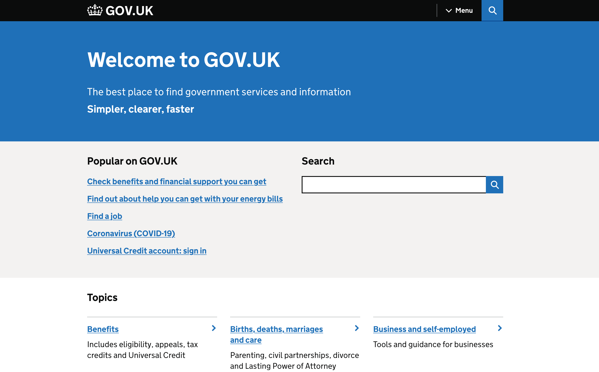

Il portale ufficiale del governo del Regno Unito, [GOV.UK](https://www.gov.uk/), è il punto di accesso per tutte le informazioni e i servizi pubblici del Paese.

È molto curato, semplice da consultare e ben organizzato. C'è anche un campo di ricerca che permette di trovare rapidamente più o meno qualsiasi cosa.

Funziona talmente bene come sistema che ha ispirato anche altri governi (Germania, Francia, Grecia) e secondo me andrebbe semplicemente copiato. Dovremmo farlo specialmente in Italia, visto che non abbiamo nulla di nemmeno vagamente confrontabile.

Ma prima, vediamo alcuni esempi di situazioni in cui GOV.UK può aiutare. Poi confronteremo con la situazione italiana.

- **Bollette troppo alte?** C'è una [pagina dedicata](https://www.gov.uk/get-help-energy-bills) con un riepilogo delle agevolazioni introdotte dal Governo.
- **Cerchi informazioni sul COVID-19?** C'è una [sezione apposita](https://www.gov.uk/coronavirus) con tutte le informazioni su tamponi, vaccinazioni, viaggi all'estero e cosa fare in caso di contagio.
- **Vuoi sapere cosa devi fare in caso di decesso di una persona vicina?** C'è letteralmente una [guida step by step](https://www.gov.uk/when-someone-dies) con tutti i passaggi: registrazione del decesso, come si organizza un funerale, come funziona con l'eredità, ecc. Stessa cosa per le nascite.
- **Ti serve un certificato di nascita, morte o matrimonio?** C'è il [modulo online](https://www.gov.uk/order-copy-birth-death-marriage-certificate) per richiederlo.
- **Vuoi sapere come funziona il sistema giudiziario e i processi?** C'è [un'intera sezione](https://www.gov.uk/browse/justice) con decine di articoli sulla segnalazione dei reati, sull'assistenza legale, sui tribunali, gli appelli, le sentenze, gli arresti, i tuoi diritti, ecc.
- **Come si prende la patente?** C'è la [guida step by step](https://www.gov.uk/learn-to-drive-a-car), partendo dai requisiti fino all'esame finale.
- **Cosa devi fare quando compri un'auto?** C'è la [guida step by step](https://www.gov.uk/buy-a-vehicle) che spiega come registrare il veicolo, ottenere l'assicurazione, ecc. Si possono anche abilitare gli avvisi automatici per la revisione periodica.
- **Vuoi sapere come funzionano le tasse sul reddito?** C'è una [pagina](https://www.gov.uk/income-tax-rates) che spiega precisamente come funziona la tassazione, con tutti i tassi chiaramente indicati, le eccezioni, ecc.
- **Vuoi metterti in proprio come lavoratore autonomo?** C'è una [guida step by step](https://www.gov.uk/set-up-self-employed) su cosa devi fare per iniziare.
  - Vuoi sapere quali contributi per la pensione dovrai pagare? C'è una [pagina apposita](https://www.gov.uk/self-employed-national-insurance-rates) sui contributi previdenziali per i lavoratori autonomi che spiega quanto devi pagare di preciso e come pagare.
- **Vuoi aprire una società?** C'è una [guida step by step](https://www.gov.uk/set-up-limited-company) con tutto quello che devi preparare, tra cui il controllo dei requisiti, la scelta del nome, chi saranno i soci, ecc.
  - Come si apre? [Interamente online](https://www.youtube.com/watch?v=LuWpx9ELU0Y) ovviamente.
  - La tua società vuole assumere dei dipendenti? C'è la [guida step by step](https://www.gov.uk/get-ready-to-employ-someone) che spiega da dove si comincia, cosa verificare, come funziona la tassazione, cosa va incluso nei contratti, ecc.

Questa è solo una piccola parte, ci sono **un'infinità** di altri argomenti.

Cosa abbiamo di tutto questo in Italia?

<video autoplay muted loop playsinline style="width: 60%; margin-left: 0">
    <source src="/meme/laugh-spit.mp4" type="video/mp4">
</video>

Quasi nulla. Quando va bene è tutto sparso tra i diversi siti della pubblica amministrazione. Ma nella maggior parte dei casi queste informazioni sono sotterrate nella normativa. A svolgere il compito del portale GOV.UK in Italia ci provano vari blog e siti web (gestiti da "privati"), che però chiaramente hanno i loro interessi magari non sempre allineati con l'esigenza di avere informazioni precise e aggiornate.

Il problema è secondo me particolarmente grave per quanto riguarda il fisco: spesso non esiste letteralmente un modo per conoscere quale sia la tassazione attuale senza affidarsi a portali a caso (o a consulenti dedicati che per esperienza a volte si affidano a loro volta a questi portali a caso).

Facciamo un esempio: voglio aprire una partita IVA, come faccio a sapere quali contributi INPS per la pensione dovrò pagare obbligatoriamente?
- Provo sul sito dell'Agenzia delle Entrate, visto che i pagamenti vengono fatti all'AdE. Cerco "contributi inps", i risultati [non c'entrano niente](https://archive.is/R1Aba). Allora vado nella sezione *Professionisti*, la cosa che più si avvicina è *Pagamenti*. Dentro c'è un *Calcolo dei pagamenti*, interessante. Entro e si parla di *Addizionale erariale sulle tasse automobilistiche* e di *Bollo auto*, ma che c'entra? Vabbè, il sito dell'AdE non parla di contributi INPS.
- Provo sul sito INPS, recentemente rinnovato. Cerco "contributi partita iva", il [primo risultato](https://archive.is/KQ5l5) è *F24 per pescatori autonomi* 🤦‍♂️. Gli altri non sono da meno. Allora provo ad andare nella sezione *Imprese e liberi professionisti*, la voce che più assomiglia a quello che cerco credo sia *Debiti contributivi*. Ok forse no, la pagina parla di regolarizzazioni e rateizzazioni. Forse in *Apertura, variazione, chiusura, azienda/attività*? Hmm, la prima voce è il servizio per la *Cancellazione artigiani*, direi di no.

Missione fallita. Non c'è letteralmente un modo per trovare quanti contributi devi pagare quando apri una partita IVA partendo dai siti web istituzionali. È probabilmente tutto sparso tra leggi di bilancio e circolari.

È una situazione ridicola, che però non sarebbe così difficile da risolvere. Quanto potrà mai costare istituire un gruppo di lavoro che si occupi di riempire lentamente un portale come GOV.UK di informazioni ufficiali, affidabili e aggiornate?

Posso riuscire a sopportare il fatto che la burocrazia sia eccessivamente complessa e ostica, ma il fatto che non si faccia nemmeno un mezzo tentativo per spiegare come funzionano le cose, anche nella loro complessità, non ha giustificazioni.

Per ora mi sa che dovrò continuare a sognare che il sito governo.it smetta di essere l'archivio fotografico dei viaggi del Presidente del Consiglio e diventi invece una fonte di informazioni effettivamente utile a cittadini (e non).
