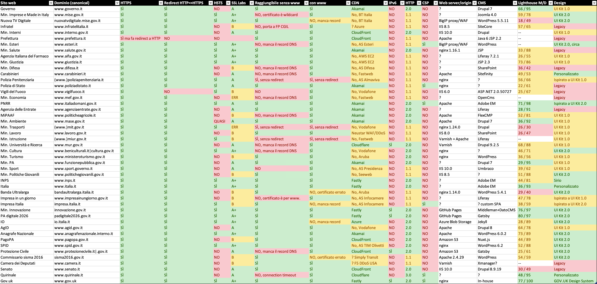
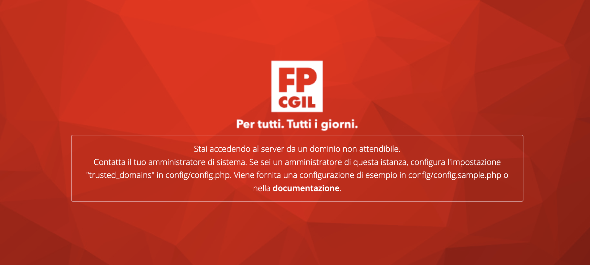

🔍 ***Una versione meno tecnica e più discorsiva di questo articolo è stata pubblicata [su Agenda Digitale](https://www.agendadigitale.eu/sicurezza/siti-della-pa-centrale-carenti-anche-sulla-sicurezza-ecco-tutti-i-problemi/).***

---

Questa è la seconda edizione dell'**analisi dei siti web della pubblica amministrazione**. La prima risale a febbraio 2022 e la trovate [qua](https://forum.fibra.click/d/27650-analisi-configurazione-siti-web-pubblici-e-governativi).

Quest'anno ho analizzato **46 siti web** (+9) ed estratto i seguenti parametri di valutazione, spiegati meglio sotto:

- presenza di HTTPS
- redirect automatico da HTTP a HTTPS
- presenza di HSTS
- grado di sicurezza SSL Labs
- raggiungibilità senza "www." e con "www."
- eventuale CDN utilizzata
- supporto a IPv6
- versione HTTP
- presenza dell'header `Content-Security-Policy` **(nuovo)**
- web server utilizzato
- CMS utilizzato **(nuovo)**
- punteggio Lighthouse mobile/desktop **(nuovo)**
- conformità alle linee guida di design per i servizi della pubblica amministrazione

Il foglio Excel originale lo trovate [qua](https://1drv.ms/x/s!AgJdWI23CtyPmr1F1RFDPOEBGoIovw).

I dati sono stati raccolti il 25 e 26 aprile 2023, in parte con l'aiuto [di uno script](https://github.com/matteocontrini/analisi-siti-web-pa) e in parte manualmente (non tutto è facilmente automatizzabile). Potrebbero in entrambi i casi esserci degli errori.


*Leggi anche [**L'Italia dovrebbe copiare il portale GOV.UK**]()*


## Parametri di valutazione

*Se non ti interessano le spiegazioni, puoi saltare questa sezione e andare direttamente a [Le novità: cosa migliora e cosa peggiora](#le-novità-cosa-migliora-e-cosa-peggiora).*

#### HTTPS

Se il sito web è accessibile e consultabile in HTTP over TLS (HTTPS). Deve esserlo.

#### Redirect HTTP => HTTPS

Se accedendo al sito web in `http://` viene fatto un redirect automatico alla versione "sicura" `https://`. Ci deve essere.

#### HSTS

Se nella risposta del sito web in HTTPS è presente l'header `Strict-Transport-Security`, che serve ad indicare al browser che questo sito web dovrebbe essere raggiunto solo in HTTPS da quel momento in poi (semplificando un po'). È un sistema per prevenire gli attacchi Man In The Middle ma anche per evitare redirect inutili.

La presenza dell'header è ormai pratica consolidata da diversi anni.

#### Grado SSL Labs

La valutazione del grado di sicurezza della configurazione SSL/TLS secondo https://www.ssllabs.com/ssltest/

Va dalla lettera A alla lettera F. Il sito restituisce un rapporto ovviamente molto più dettagliato.

Il punteggio ideale è A o B. Un punteggio B non è necessariamente negativo perché potrebbe solo voler dire che è presente il supporto a TLS 1.0 e/o TLS 1.1, protocolli ormai vecchi ma che a volte è necessario mantenere attivi per retrocompatibilità, con una scelta consapevole. (Ad esempio il team dietro al sito del governo inglese [tiene monitorata](https://twitter.com/TheRealNooshu/status/1418741085501804544) la quantità di traffico per versione di TLS mantenendo abilitato TLS 1.0 nonostante la CDN usata ufficialmente non lo supporti più.)

#### CDN

Se il servizio è fornito con l'ausilio di una Content Delivery Network. È una scelta di solito saggia perché permette sia di sfruttare le funzionalità di caching sia di proteggersi meglio dagli attacchi grazie a Web Application Firewall (WAF) e DDoS mitigation.

#### IPv6

Se il sito è accessibile tramite IPv6.

#### Versione HTTP

La versione massima di HTTP supportata.

HTTP 2.0 è ampiamente supportato sia dai browser che dai server web ormai da qualche anno e ci si aspetta che sia abilitato.

HTTP 3.0 è invece standard solo da giugno 2022. Non è ancora molto diffuso a livello di server web (es. nginx non lo supporta) ma sostanzialmente tutte le CDN lo supportano. Salvo casi particolari non c'è motivo per non abilitarlo.

#### Content Security Policy (CSP)

Se è presente l'header di risposta HTTP `Content-Security-Policy`. L'header specifica alcuni criteri di sicurezza per limitare il tipo di contenuti che possono essere caricati nelle pagine (es. script, fogli di stile e font da quali domini, se è consentito JavaScript inline, ecc.).

Ho considerato CSP "valide" solo quelle un minimo articolate e che come minimo restringono le sorgenti degli script (`script-src`).

#### Web server/origin

Il server web utilizzato dal sito web (es. nginx). Non è sempre facilmente identificabile con precisione e in alcuni casi corrisponde al servizio utilizzato per l'hosting di siti web statici (es. Amazon S3). Non c'è una scelta corretta, è più per curiosità.

#### Content Management System (CMS)

Il CMS utilizzato dal sito web. Anche qua non c'è una scelta corretta (non sono un WordPress-nazi), ma ecco, utilizzare Java 6 o .NET 2.0 (tecnologie di circa vent'anni fa) escludo sia una buona idea.

#### Punteggio Lighthouse

Il punteggio "performance" di Lighthouse di Google, ottenuto tramite [PageSpeed Insights](https://pagespeed.web.dev/), sia per mobile che desktop (due indicatori 0-100).

Da prendere un po' per le pinze, sia perché il test non è deterministico sia perché è noto per essere molto *picky*. Il colore nella tabella è legato al punteggio desktop (0-49 rosso, 50-89 giallo, 90-100 verde), e diciamo che andare sotto 60 può essere un indicatore di qualche problema.

#### Design

Ho provato a categorizzare lo stile grafico dei siti web per capire quanto aderiscono alle [linee guida di design](https://designers.italia.it/) per i servizi pubblici di Designers Italia, gruppo di lavoro del Dipartimento per la Trasformazione Digitale.

Seppur l'aspetto grafico dei componenti non sia sufficiente da solo per definire quanto il sito sia conforme alle linee guida (il "kit" prevede 15 passaggi di cui solo 2 riguardano la UI), è un utile indicatore della "modernità" del sito web e l'unico elemento valutabile in modo vagamente oggettivo. Se un sito web non segue nemmeno le linee guida per l'interfaccia grafica, è difficile credere che sia stato seguito come si deve l'intero processo di progettazione del sito.

I valori in particolare significano:

- **Legacy**: siti web che hanno un design precedente alle linee guida di design e che non è giustificato restino con un design vecchio
- **UI Kit 1.0**: siti web che seguono il design system ufficiale ma nella versione iniziale, precedente al 2019 (es. https://www.governo.it)
- **UI Kit 2.0**: siti web che seguono il nuovo design system ufficiale pubblicato nel 2019. La distinzione tra 1.0 e 2.0 non è sempre chiara perché ogni sito fa un po' quello che gli pare mischiando le cose, ma quando ci sono elementi del kit 2.0 è abbastanza evidente (es. https://padigitale2026.gov.it/)
- **Ispirato a...**: ci sono dei siti web che si ispirano al design system ufficiale riprendendo elementi come i colori e il font. Non è di per sé sbagliato ma considero al passo con i tempi solo i design ispirati al kit 2.0
- **Sirio**: è il design system dell'INPS, potrebbe sorprendere ma è davvero ottimo e molto curato (https://www.inps.design)
- **Personalizzato**: alcuni siti hanno un design personalizzato ma la scelta può essere giustificata, ad esempio per siti promozionali (es. Italia.it) o di istituzioni particolari (es. il Quirinale). A differenza dei siti *legacy*, "non sanno di vecchio" e sono quantomeno responsive

Nota: questa categorizzazione non è una scienza esatta e in alcuni casi è un po' soggettiva, quindi prendetela come una informazione indicativa.

## Le novità: cosa migliora e cosa peggiora

- Cambiano diverse CDN:
  - `www.interni.gov.it` passa da Akamai a CloudFront, guadagna HTTP/2 ma non IPv6
  - `www.prefettura.it` passa da Akamai a CloudFront: assurdamente, la versione HTTPS continua a fare redirect verso HTTP. A quanto pare si sono anche presi la briga di *disabilitare* HTTP/2, che altrimenti sarebbe attivo di default
  - `www.salute.gov.it` passa da Cloudflare ad Akamai. Nell'operazione si sono persi per strada sia IPv6 che HTTP/3
  - `www.italia.it` passa (credo in concomitanza con un redesign) da Akamai a Fastly. Guadagna HSTS
- Alcuni siti prima senza CDN ora ce l'hanno:
  - `www.italiadomani.gov.it`, `www.agenziaentrate.gov.it` e `www.politicheagricole.it`, prima Sogei, ora sono dietro Akamai. Guadagnano HTTP/2 ma non IPv6
  - `www.mase.gov.it` passa da BT Italia ad Akamai, guadagna HTTP/2 ma non IPv6
  - `www.lavoro.gov.it` finisce dietro WAF/anti DDoS Neustar, prima era diretto su AS Vodafone
  - `www.inps.it` con il redesign passa da infrastruttura Fastweb al cloud, con Fastly. Guadagna HTTP/2 ma non IPv6
  - `www.senato.it` passa dall'AS Camera dei Deputati a CloudFront. Guadagna HTTP/2 ma non IPv6
- Un sito ha deciso che le CDN non fanno per loro:
  - `www.giustizia.it` ha *tolto* la CDN CloudFront e il dominio ora punta direttamente a una EC2 (sempre AWS)
- Il grado SSL Labs migliora per diversi siti:
  - `www.mise.gov.it`, `nuovatvdigitale.mise.gov.it` e `www.esteri.it` passano da B ad A+. Questi siti sembrano essere dietro un proxy/WAF "BigIP" di F5, quindi è possibile sia cambiato qualcosa in quel software
  - anche `www.inps.it` passa da B ad A+, grazie a Fastly
  - `www.carabinieri.it` e `www.senato.it` da B a A (il secondo grazie a CloudFront)
  - `www.italiadomani.gov.it`, `www.mase.gov.it` e `www.italia.it` passano da A ad A+, tutti e tre perché è cambiata la CDN
  - `www.politicheagricole.it` passa da C ad A+ grazie ad Akamai
  - nessun sito è più in grado C o inferiore!
  - bonus: `www.gov.uk` passa da B ad A+ (sempre Fastly, sono stati disattivati TLS 1.0 e 1.1)
- Il grado SSL Labs peggiora per un sito:
  - `www.impresainungiorno.gov.it` passa da A a B (sì, è peggiorato)
- `www.quirinale.it` perde inspiegabilmente HSTS, non è cambiata la CDN né altro
- Redirect e dintorni:
  - `governo.it` senza www ora fa correttamente redirect verso `www.governo.it`
  - `http://www.carabinieri.it` fa ora redirect verso la versione HTTPS
  - `www.italiadomani.gov.it` è ora il dominio canonical per il sito, prima con il `www.` non si apriva del tutto
  - `impresa.italia.it` era accessibile anche con `www.` davanti, ora non più 🤷‍♂️
  - `sisma2016.gov.it` non era accessibile senza `www.` (certificato errato), ora invece è accessibile solo senza
  - `www.senato.it` è ora canonical, prima il sito era "duplicato" sulla versione senza www

## I problemi che restano

- Persiste il grandissimo caos tra domini con `www.` e senza. In alcuni casi il sito è accessibile solo con `www.`, in altri solo senza. In alcuni casi il sito è addirittura accessibile con entrambi ma senza redirect (cioè il sito è "duplicato")
  - È vero che alcuni browser hanno implementato delle correzioni automatiche per aggirare configurazioni errate di questo tipo, ma non è una giustificazione. Resta il rischio che se scrivi `esteri.it` il sito non si apra perché non c'è il `www.`
- Continuano ad esistere siti web identici su domini diversi, ad esempio `www.beniculturali.it` e `cultura.gov.it`
- Non c'è ancora nessuna coerenza sull'uso di `.gov.it` o `.it` come TLD, è essenzialmente a caso
- Solo 22 siti su 46 supportano HTTP/2, soltanto uno supporta HTTP/3
- Solo 4 siti su 46 sono accessibili via IPv6
  - In alcuni casi, come quando c'è CloudFront, IPv6 è abilitato di default e basterebbe creare il record `AAAA` sul dominio. Un'operazione da un minuto
- Se non mi è sfuggito qualcosa, non c'è stato alcun progresso sul design dei siti web, che restano per la maggior parte obsoleti

## I nuovi problemi

- Una delle *new entry*, `www.vigilfuoco.it`, non fa redirect da HTTP a HTTPS ma ha HSTS. Immagino sia una svista
- Per quanto riguarda la `Content-Security-Policy`, non ci siamo: è presente in solo 5 siti su 46. Comprendo che sia una funzionalità avanzata e complessa da configurare correttamente, ma stiamo parlando dei siti web di un Governo, non di un'associazione di volontariato
- C'è una grande varietà di CMS utilizzati. Su 46 siti ho rilevato almeno 18 CMS o tecnologie diverse utilizzate per realizzare i siti. Immagino che i team che sviluppano e gestiscono questi siti web siano indipendenti, perché altrimenti non avrebbe senso acquisire competenze su 18 CMS diversi
- Si sta diffondendo l'uso di Adobe Experience Manager come CMS. Non mi è del tutto chiaro cosa sia e come funzioni, ma non sono sicuro che legare a lungo termine siti web critici della PA (come `www.inps.it`) ad Adobe sia una scelta saggia
- L'uso di tecnologie obsolete non ha giustificazioni: notate la presenza di IIS 6.0 (fine vita 2015), .NET 2.0 (fine vita 2011), Java 6 e JSP 2.2
- Seppur l'indice di prestazioni di Lighthouse abbia dei limiti, come indicato sopra, ci sono dei siti terribilmente lenti e con un'esperienza pessima specialmente su reti mobili. Questa dovrebbe essere una delle priorità principali (non a caso `www.gov.uk` ottiene il punteggio 77 / 100, più alto di *tutti* gli altri 46 siti)

## Le mostruosità

- `https://infratelitalia.it/` porta a una pagina di errore della "CGIL Funzione Pubblica". Mi sfugge cosa c'entri la CGIL con Infratel Italia

- Il sito del Ministero della Giustizia (`www.giustizia.it`) ha questa `Content-Security-Policy`: `Content-Security-Policy: script-src 'unsafe-inline' 'unsafe-eval' * ;`. Ora, io non sono un esperto di CSP, ma l'asterisco unito alle altre sorgenti mi sembra equivalente a non impostare l'header del tutto

- Il sito INPS ha un header `x-var-prova: prova` in risposta a tutte le richieste

- Il Ministero delle Infrastrutture e dei Trasporti (`www.mit.gov.it`) ha questo header in risposta a tutte le richieste: `X-Generator: XXXXXXXXXXXXXXXXXXXXXXXXXXXXXXXXX)`

- Il sito Italia Domani (`www.italiadomani.gov.it`) si apre con un filmato dalla durata di un minuto con un bitrate medio di più di 7 Mbps per il video e tra 317 e 410 kbps per l'audio, per un totale di quasi 50 MB. È una follia, si riesce ad ottenere un risultato di qualità simile con circa 3 Mbps + 128 kbps (20 MB)

## Chi si salva

Se teniamo in considerazione l'intero insieme di criteri (discutibile, chiaramente), **nessuno**.

Si salverebbe soltanto `www.gov.uk`, che ho non a caso messo come riferimento (il team GOV.UK è molto attento a questi aspetti).

Se togliamo il requisito CSP, che effettivamente in alcuni casi (come per i siti statici) potrebbe non essere fondamentale, gli unici due siti con tutti gli indicatori "verdi" sono `innovazione.gov.it` e `padigitale2016.gov.it`. Non mi stupisce, visto che sono realizzati dal Dipartimento per la Trasformazione Digitale che fa sempre un ottimo lavoro. I due siti sono tra l'altro [open source](https://github.com/teamdigitale/innovazione.gov.it-site).

## Curiosità

- Il Ministero dell'Agricoltura (`www.politicheagricole.it`) usa il CMS *made in Italy* FlexCMP, che si pubblicizza con questo lungo header nelle risposte: `x-powered-by: FlexCMP Application Server [v. 7.8.09 - 2022.02.04 12.05 (2022.02.28 11.37)] (c) 2000-2022 Deda Digital s.r.l. - Bologna, Italy - www.flexcmp.com - www.deda.digital`

- Il MEF (`www.mef.gov.it`) ha donato al web dell'ASCII art:

- Il Ministero della Salute (`www.salute.gov.it`) e il Quirinale (`www.quirinale.it`) hanno un header `Content-Length` aggiuntivo ma con alcune lettere scambiate (`ntcoent-length` e `cteonnt-length`). Il valore dovrebbe essere la dimensione della risposta non compressa e secondo [alcuni](https://davidkeen.com/blog/2017/10/jumbled-headers/) sarebbe un "trick employed by hardware appliances (e.g. Citrix NetScaler) to ‘remove’ a header without affecting the check-sum value".

## Conclusioni

Come l'anno scorso mi astengo da ulteriori commenti: non ho idea di come funzioni l'organizzazione che sta dietro a tutti questi siti web e non so quali siano i problemi che portano a questo grandissimo caos.

Faccio soltanto notare nuovamente che i risultati migliori si ottengono quando i siti web sono realizzati da un team moderno e attento come quello del Dipartimento per la Trasformazione Digitale, in cui probabilmente converrebbe investire molto di più.

All'anno prossimo!
