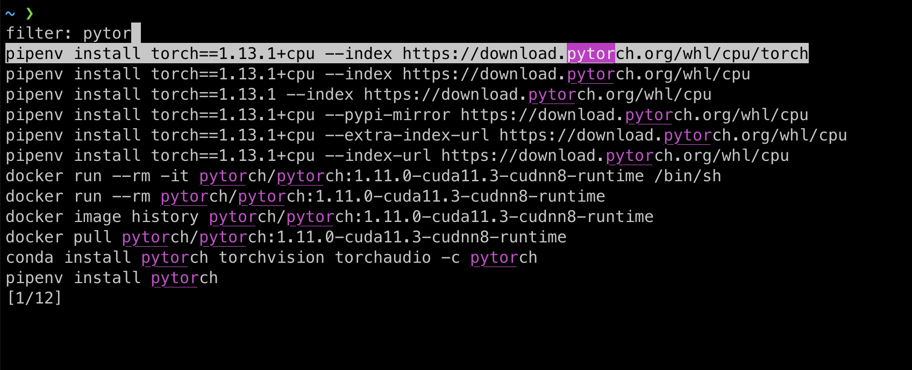

In this post I'm going to share the setup and configuration of the terminal and shell I use on macOS. I don't consider myself an advanced shell user, but there's some useful stuff that might be helpful to some.

## iTerm2

I'm using [iTerm2](https://iterm2.com/) and not the default macOS terminal because... this is what everyone does?

I've changed a few settings in the iTerm2 preferences, after duplicating the default profile. Specifically, I:

- changed "**minimum contrast**" to 50, it works better with the colors used by my zsh theme (there's a probably a better way)
- changed the **default window size** from 80x25 to 110x28 and the **font size** from 13 to 15
- enabled **unlimited scrollback**
- replaced the key mappings with the **"Natural Text Editing"** preset. This makes it possible to move between "words" with Option+arrows, and other stuff

## zsh

Not gonna lie, I'm using `zsh` because it's the default on macOS.

However, there are lots of features that make it better than `bash` out of the box. One of these is the improved tab completion when choosing files or directories:

<video controls style="width:100%">
    <source src="zsh-autocomplete.mp4" type="video/mp4">
</video>

There are so many [other tricks](https://code.joejag.com/2014/why-zsh.html) like this and I probably don't even know most of them.

## Oh My Zsh

[Oh My Zsh](https://ohmyz.sh/) not only makes it easier to install plugins and themes, but also comes with defaults, helpers and aliases that improve the overall experience in the terminal.

For example, `ll` as an alias of `ls -lh`.

## powerlevel10k

[powerlevel10k](https://github.com/romkatv/powerlevel10k) is one of the most used themes for zsh and can be easily customized.

It comes with "segments", which are additional labels decorating the prompt.

I personally use the lean style with some tweaks, but there are many other possible configurations.


## zaw

[zaw](https://github.com/zsh-users/zaw) is a replacement for the `CTRL-R` (`^R`) reverse history search. I use it all the time.



*(☝️ me trying to install PyTorch for CPU)*

To install it, follow the instructions in the [GitHub repositiory](https://github.com/zsh-users/zaw) and then add the following to your `.zshrc`, which are good defaults:

```sh
bindkey '^R' zaw-history
zstyle ':filter-select' case-insensitive yes
zstyle ':filter-select' extended-search yes
zstyle ':filter-select' hist-find-no-dups yes
```

## zsh options

These are some options that I changed. I put these in the `.zshrc` file:

- Added `setopt no_share_history` so that the histories of different tabs/windows of the terminal aren't shared (i.e. when you press `Up` you don't see commands from other shell instances)
- Added `setopt histignorespace` to keep commands starting with a space from being saved in the history. This is helpful when you need to store secrets in environment variables. For example, you can use `⎵export TOKEN=...` (space before `export`)
- Uncommented the line that says `DISABLE_MAGIC_FUNCTIONS="true"` to stop pasted links from being escaped. This solves the issue of having symbols like `?` being escaped as `\?`, which often creates more issues than it solves

## zsh plugins

I use the following three plugins:

```sh
plugins=(git sudo zsh-syntax-highlighting)
```

- `git` adds git information to the prompt
- `sudo` makes it possible to re-execute the last command with sudo, just by pressing `esc` twice
- [`zsh-syntax-highlighting`](https://github.com/zsh-users/zsh-syntax-highlighting) highlights the syntax of the commands as you write

I've also used [`zsh-autosuggestions`](https://github.com/zsh-users/zsh-autosuggestions) for a while but it confused me more than it helped.

## Other integrations

I also use:

- [1Password SSH/git integration](https://developer.1password.com/docs/ssh/): the password manager is my keystore and my fingerprint replaces the passphrases of the keys
  - I previously used a variant of [this script](https://stackoverflow.com/a/18915067/1633924) to have the `ssh-agent` remember the passphrases of my keys for a few hours after entering them for the first time. If you're interested, leave a comment
- [GitHub Copilot for CLI](https://githubnext.com/projects/copilot-cli): having an AI to generate commands is often useful for tools I'll never manage to learn, like `jq` or `awk`

---

I'll try to keep this updated as my setup changes. If you have anything to share, leave a comment 👇
