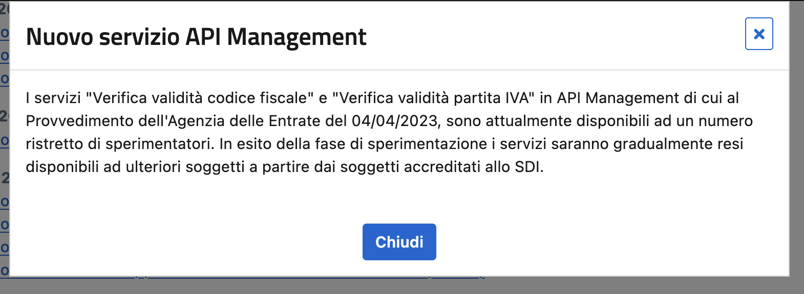

Da qualche mese l'**Agenzia delle Entrate** sta lavorando a delle **nuove API per la verifica della validità delle partite IVA e dei codici fiscali**.

Sembra assurdo, ma **finora non c'era un metodo ufficiale** per validare questi dati in modo automatizzato. Esisteva soltanto il servizio di verifica sul [sito ufficiale](https://telematici.agenziaentrate.gov.it/VerificaPIVA/Scegli.do?parameter=verificaPiva), protetto però da un CAPTCHA.

Il paradosso è che è l'Agenzia stessa a richiedere alle aziende di emettere fatture che contengano dati corretti, ma allo stesso tempo l'AdE non fornisce un modo per automatizzare questa procedura.

Per questo **le aziende per ora si sono arrangiate** in altro modo. I due metodi principali sono:

- sfruttare **servizi a pagamento** forniti da aziende private: la più nota è Cerved a cui spesso ci si riferisce come "la banca dati Cerved" (non ho ben chiaro da dove prendano i dati, ma sono di fatto un database dettagliato di tutte le imprese italiane).

- per i numeri di partita IVA abilitati agli scambi con altri paesi europei, e quindi iscritte al **sistema del VIES**, esiste un servizio web JSON della Commissione Europea che ritorna i dati dell'impresa corrispondente al numero di partita IVA richiesto. È senza dubbio imperfetto (è pieno di inconsistenze e la sua affidabilità non è al livello che ci si aspetterebbe per un servizio così importante: nel momento in cui scrivo non funziona), ma esiste, è semplice, è veloce, non ha limiti significativi e non richiede nessuna forma di autenticazione.

Ora fortunatamente l'**Agenzia delle Entrate** si è svegliata. No, scusate, non è stata l'Agenzia delle Entrate. Il **decreto legge n. 77 del 2021** stabilisce che le pubbliche amministrazioni e gli entri controllati "progettano e sviluppano i propri sistemi servizi in modo da **garantire l'integrazione e l'interoperabilità tra i diversi sistemi e servizi** […], espongono per ogni servizio le relative interfacce applicative" secondo le linee guida dell'AgID, l'Agenzia per l'Italia Digitale.

L'AgID ci ha pensato su qualche mese ma il suo lavoro l'ha fatto: nell'ottobre 2021 ha approvato le [linee guida tecniche](https://www.agid.gov.it/sites/default/files/repository_files/linee_guida_tecnologie_e_standard_sicurezza_interoperabilit_api_sistemi_informatici.pdf) per l'interoperabilità. Tradotto: ha definito degli standard minimi che le API devono avere, le tecnologie che si possono usare, i protocolli consigliati, ecc.

Poi non è successo niente.

Arriva il 2023, il 4 aprile 2023, e l'Agenzia delle Entrate pubblica un [provvedimento](https://www.agenziaentrate.gov.it/portale/documents/20143/5202816/Provvedimento+del+4_4_23+servizi+in+Api.pdf/4e3a2055-c75b-fb0c-daac-7dda27ee6a1c) in cui si decide di attivare "la **piattaforma di API Management** per l'erogazione dei servizi di libero accesso". I primi due servizi ad essere attivati sono proprio la verifica partita IVA e codice fiscale, a partire dal 15 maggio 2023.


Il 15 maggio il servizio di "API Management" effettivamente compare, ma risulta essere **disponibile solo ad un "numero ristretto di sperimentatori"**.



Per [vie traverse](https://forum.italia.it/t/servizi-per-check-codice-fiscale-e-partita-iva/10732/134) si scopre che **questi sperimentatori sono alcune software house associate all'associazione di categoria AssoSoftware**, che possono quindi già integrare le nuove API nei loro software.

Insomma, anziché concepire un progetto di sperimentazione aperto, o quantomeno basato sulla diversificazione degli use case di utilizzo per verificare l'effettiva idoneità delle API, si sceglie di far "testare" le API ad **alcune aziende opacamente selezionate** che sviluppano gestionali, chiaramente concedendo loro un certo vantaggio rispetto agli altri sfortunati che non vantano affiliazioni o contatti con associazioni di categorie, e che nel frattempo continueranno a pagare altri servizi.

In ogni caso, **i mesi continuano a passare ma novità non se ne vedono**. L'Agenzia delle Entrate non ha mai eccelso in comunicazione, ma qua non ci sta nemmeno provando. Le informazioni arrivano tramite comunicati stampa oppure negli articoli del Sole 24 Ore.

**Ottobre 2023**. Qualcuno sul [forum Italia.it](https://forum.italia.it/t/servizi-per-check-codice-fiscale-e-partita-iva/10732/162) fa notare che è ora possibile registrarsi al servizio di API tramite il portale servizi dell'AdE:

Più o meno. Ad alcuni funziona, ad altri no. A volte è sufficiente *Cambiare utenza di lavoro* e selezionare la propria azienda, altre volte no. Non si capisce, e l'Agenzia delle Entrate ha scelto di non comunicare. Le cose cambiano, ma non lo dice a nessuno.


**Ma come sono fatte queste API? Ne è valsa la pena?**

Quello che si sa al momento è che sono previsti diversi piani ([fonte](https://forum.italia.it/t/servizi-per-check-codice-fiscale-e-partita-iva/10732/165)):


Notate come uno dei piani si chiami "business": come se gli altri piani non fossero pensati per il business.

Secondo [un post](https://forum.italia.it/t/servizi-per-check-codice-fiscale-e-partita-iva/10732/195) pubblicato sul forum Italia.it che i piani vengono **assegnati automaticamente in base al numero di fatture emesse in media al giorno** dall'azienda, calcolate sul primo semestre del 2023. Ad esempio **il piano standard si applica a chi crea meno di 10.000 fatture al giorno**.


Quello che fa storcere il naso sono i **rate limit** associati ai piani: ad esempio nel piano standard il limite sarebbe di 500 richieste al giorno, a fronte di 10.000 fatture emesse. Lascia ancora più perplessi il limite di **2 richieste al minuto**: significa che se uno inserisce un numero di partita IVA in un form e sbaglia una cifra, al secondo tentativo **il limite è già raggiunto**.

Per molti questi limiti renderanno le API quasi inusabili nel mondo reale e non si capisce bene perché i limiti, specialmente quello al minuto, siano così bassi:

- se l'obiettivo è scongiurare l'estrazione massiva, a quello ci pensa già il limite giornaliero;

- se l'obiettivo è limitare il carico, credo che i potenti sistemi di Sogei siano in grado di gestire ben più di due richieste al minuto. Non so quale architettura ci sia dietro queste API, ma un lookup di un numero in un database non è sicuramente tra le operazioni computazionalmente più impattanti che l'Agenzia delle Entrate esegue.

Paradossalmente, lo strumento di verifica p. IVA/codice fiscale messo a disposizione online, quello con il CAPTCHA, non sembra avere questi limiti.

**Le API stesse non sono dei capolavori di ingegneria**:

- nonostante queste API siano chiaramente ad uso potenzialmente internazionale, **sono in tutte le loro parti in italiano**: il campo che indica se il numero di partita IVA è valido si chiama `valida`, quando chiunque lo chiamerebbe `isValid`, seguendo convenzioni consolidate forse da qualche decennio.

- è poi la stessa documentazione ad ammettere che del campo `dataInizioAttivita` non ci si può fidare. Dice: "alcune date potrebbero essere espresse nei seguenti formati '1001-01-01', '9999-12-31'. Tali date devono essere interpretate come informazioni assenti o non certe".

- la documentazione dice anche che "il servizio non richiede autenticazione", ma non è vero:

```sh
curl -s https://api.agenziaentrate.gov.it/entrate/api/partita-iva/v0/verifica/06363391001 | jq
{
  "type": "https://developer.agenziaentrate.gov.it/handling-errors/401/AuthenticationFailed.html",
  "title": "AuthenticationFailed",
  "status": "401",
  "detail": "Credenziali di accesso non valide"
}
```

E infatti prosegue poi dicendo che:

>Pur essendo questa API di pubblico accesso, è richiesto l'invio delle API Key che consentono all'infrastruttura di applicare le politiche di throttling definite nell'ambito del piano sottoscritto.

**Di fatto, si parla di autenticazione**: la API key è associata a un piano e il piano dipende dall'azienda che sta utilizzando le API, che deve essere identificata prima di poter rispondere alla richiesta.

La giustificazione del throttling non regge molto qua: l'API di verifica del VIES applica probabilmente anch'essa dei rate limit ma non richiede alcuna API key: se dei limiti ci sono, sono applicati in base all'indirizzo IP.

---

Arriviamo come al solito al **"come si poteva fare?"**, e la risposta, come al solito, è: un buon primo passo è **prendere ispirazione** da chi ci è già passato e l'ha già fatto.

Il **governo del Regno Unito**, sempre un riferimento per quanto riguarda i servizi digitali, dispone di un [catalogo API](https://www.api.gov.uk) che comprende anche il servizio di [verifica dei numeri di partita IVA](https://developer.service.hmrc.gov.uk/api-documentation/docs/api/service/vat-registered-companies-api/1.0). Come ci si aspetterebbe, è gratuito, senza autenticazione e senza evidenti rate limit.

Bastava copiare.
