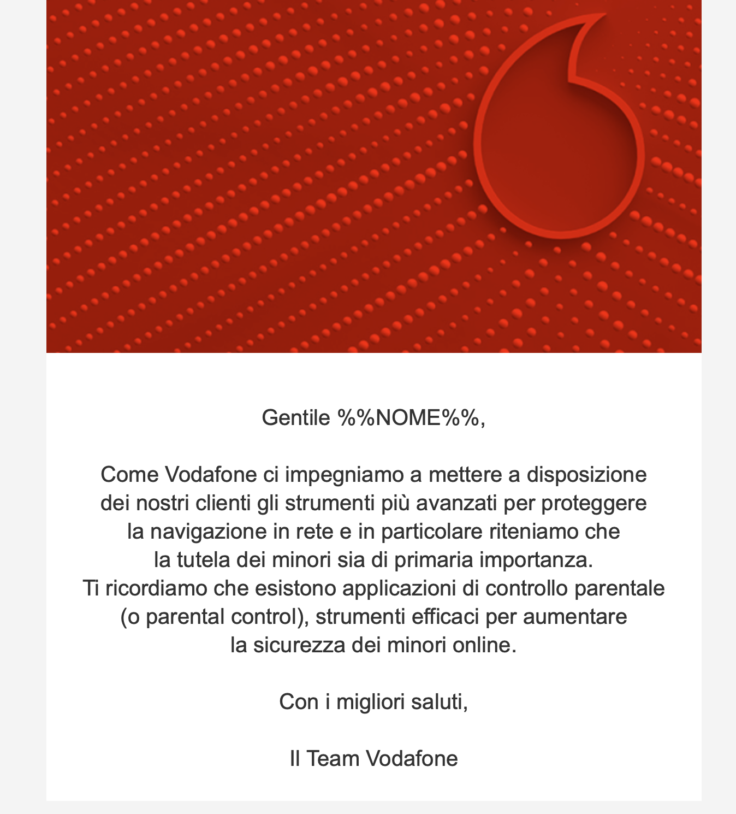

Negli ultimi giorni potreste aver ricevuto una comunicazione dal vostro gestore di telefonia fissa o mobile in merito alla **possibilità di attivare un sistema di controllo parentale** sul vostro dispositivo o sulla vostra linea Internet.

Questo avviso è l'effetto di un decreto legge di settembre 2023 che impone l'invio di questa comunicazione a tutti gli operatori, ma coincide con l'**imminente entrata in vigore delle nuove regole sul parental control**, che dovrà essere obbligatoriamente fornito come servizio gratuito da tutti gli operatori, come stabilito da una discussa legge del 2020.

Quanto segue è per chi si è perso dei passaggi: come siamo arrivati fin qui e se alla fine abbiamo risolto qualcosa, partendo dall'inizio.

## Il decreto del 2020

Il contesto è quello dell'inizio dell'estate del 2020, quando eravamo appena usciti dal primo lockdown dovuto alla pandemia. Il governo in carica è il Conte II, con una maggioranza composta da M5S e PD.

Il senatore **Simone Pillon**, parte della "grande famiglia della Lega", come gli piace [dire](https://www.repubblica.it/economia/2020/06/19/news/filtro_automatico_al_porno_su_internet_ecco_la_norma_firmata_lega-259545443/), presenta un emendamento al [decreto legge n. 20 del 30 aprile 2020](https://www.normattiva.it/uri-res/N2Ls?urn:nir:stato:decreto.legge:2020;28~art4), il cosiddetto decreto legge "giustizia".

I decreti legge sono i provvedimenti urgenti che vengono scritti e approvati direttamente dal governo: entrano in vigore immediatamente ma devono poi essere convertiti in legge entro 60 giorni. In questi 60 giorni entrambe le camere del Parlamento hanno la possibilità di emendare il decreto legge.

Pillon presenta quindi un [emendamento](https://www.senato.it/japp/bgt/showdoc/frame.jsp?tipodoc=Emendc&leg=18&id=1153427&idoggetto=1159692) che prevede l'introduzione di ***Sistemi di protezione dei minori dai rischi del cyberspazio***, cioè il **controllo parentale obbligatorio**. La Commissione Giustizia del Senato [vota](https://www.senato.it/leg/18/BGT/Schede/Ddliter/comm/52944_comm.htm) l'emendamento, che inspiegabilmente viene approvato. Non essendoci il tempo per ulteriori modifiche la norma diventa legge.

## Cosa dice il decreto

L'articolo 7-bis del decreto, tutt'ora in vigore senza modifiche, obbliga gli operatori a:

>*prevedere tra i servizi preattivati sistemi di controllo parentale ovvero di filtro di contenuti inappropriati per i minori e di blocco di contenuti riservati ad un pubblico di età superiore agli anni diciotto.*

Questi servizi di controllo parentale dovrebbero essere **gratuiti**, **preattivati su tutti i contratti di fornitura Internet** ma disattivabili dal titolare del contratto.

La formulazione dell'articolo è talmente scarna, generica e interpretabile che da subito ci sono diverse perplessità.

Il Post [scrive](https://www.ilpost.it/2020/06/25/legge-blocco-porno-online/), con una certa lungimiranza, che "**è probabile che questa norma non venga mai effettivamente applicata**".

Stefano Quintarelli, fondatore di uno dei primissimi Internet Service Provider (ISP) italiani e tra il resto ideatore anche del sistema SPID, [definisce](https://www.agendadigitale.eu/cultura-digitale/un-filtro-internet-sul-porno-in-italia-legge-inapplicabile-da-cambiare-subito/) la norma "un garbuglio legislativo **inapplicabile, irrealizzabile, potenzialmente pericolosa**" e "probabilmente scritta senza basi tecniche adeguate".

I problemi sono numerosi:

- prima di tutto, chi decide cos'è un **"contenuto inappropriato"**?
- **come si bloccano questi contenuti**? Bisogna trovare un modo per bloccare anche i video su YouTube o i messaggi su WhatsApp? Come si pensa di gestire i contenuti cifrati?
- perché questo blocco lo devono applicare gli operatori di accesso ad Internet (il cui più importante compito è apparire trasparenti dal punto di vista della rete)?
- come si concilia questo blocco preventivo di un pezzo di Internet con la normativa europea sulla **net neutrality** (regolamento *Open Internet*)?

La questione solleva [ampie discussioni](https://forum.fibra.click/d/8125-censura-ai-siti-pornografici-in-italia) e [confusi e surreali dibattiti](https://www.youtube.com/watch?v=8_Cv6v-gzoQ). Ci fa un video anche [Cartoni Morti](https://www.youtube.com/watch?v=6IPdiijcxyw) che cristallizza l'ambiguità della situazione (infilandoci naturalmente la pubblicità di una VPN, evidenziando così da subito un evidente limite della norma).

La questione è però ormai diventata tecnica: **come si applica questa legge?**

Le interviste all'ex senatore Pillon creano ancora più confusione: dopo l'approvazione dell'emendamento Pillon [parla](https://www.repubblica.it/economia/2020/06/19/news/filtro_automatico_al_porno_su_internet_ecco_la_norma_firmata_lega-259545443/) infatti di:

>*[...] introduzione dell'**obbligo per i fornitori di telefonini, tablet, laptop, tv** e altri device di **preinstallare gratuitamente sugli apparati** un filtro per bloccare contenuti violenti, pornografici o inadeguati per i minori.*

E [ancora](https://www.open.online/2020/06/20/come-funziona-filtro-porno-internet-pillon-non-decido-io/):

>*Non è un filtro per il porno ma per tutti i contenuti violenti, pericolosi o eccessivamente espliciti che non siano adatti a un pubblico di bambini. **Il funzionamento è semplice. Al momento dell’acquisto di uno smartphone, di un tablet o di un computer verranno consegnate all’acquirente le istruzioni e le password** per accedere ai servizi di parental control **preinstallati gratuitamente.***

**La legge da lui proposta dice però tutt'altro**: non parla di «fornitori di telefonini e tv» (qualunque cosa voglia dire), né di «filtri preinstallati sugli apparati» o di istruzioni e password. Parla chiaramente di operatori Internet e di «servizi preattivati». Alla faccia del "funzionamento semplice".

## La prima proposta di AGCOM

La questione viene presa in carico da **AGCOM**, l'autorità garante per le comunicazioni, a cui spetta (l'ingrato) compito di scrivere le linee guida per l'attuazione del decreto legge.

Il procedimento inizia [nel 2021](https://www.agcom.it/visualizza-documento/9530d62d-44d8-42b8-8ea4-e62ddfd2162a) e nel 2022 [viene pubblicata](https://www.agcom.it/visualizza-documento/bcc6f638-4e56-415c-a925-db8c9cdcfd59) una prima bozza di linee guida. Come da consuetudine, il documento viene sottoposto a consultazione pubblica: vengono cioè raccolti i punti di vista e le osservazioni degli interessati (cioè gli operatori) per poi procedere con la stesura e l'approvazione del provvedimento definitivo.

Il documento rimanda il problema di determinare quali siano i "contenuti inappropriati" a un altro momento e **si concentra invece sugli aspetti tecnici**: ma non passa molto che le soluzioni proposte vengono **[generalmente considerate](https://forum.fibra.click/d/28166-agcom-parental-control-tramite-dns-e-blocco-di-dot-e-doh) folli**: se applicate alla lettera porterebbero nella pratica al blocco generale del web.

I due metodi di blocco dei contenuti proposti sono il **blocco tramite DNS** e il **blocco tramite IP**.

Il **blocco tramite DNS** è il metodo classico, già in uso dagli operatori per rispettare gli obblighi imposti dai tribunali per il blocco di siti web illegali (come i servizi di streaming illegale o il gioco d'azzardo non autorizzato).

Si basa sul fatto che tutti gli operatori dispongono internamente di un **resolver DNS** che nella maggior parte dei casi viene automaticamente impostato sui router dei clienti: in questo modo la risoluzione di tutti i nomi di dominio passa prima dall'operatore, che può decidere se rispondere regolarmente alle richieste di risoluzione o se ritornare un risultato "falsificato", **con l'effetto pratico di bloccare l'accesso al sito web in questione**.

Le linee guida della bozza chiedono quindi di sfruttare i resolver interni, ma non si fermano qui: richiedono anche che i resolver DNS **«ridirigano le richieste»** dei domini da filtrare verso **una pagina «in cui viene spiegato all'utente minorenne che non può accedere** a quel contenuto poiché considerato inappropriato per la sua età o riservato ad un pubblico maggiorenne». In questa pagina dovrebbe anche esserci la possibilità di sbloccare temporaneamente l'accesso al sito web, previa autorizzazione.

Si tratta a tutti gli effetti dell'applicazione di un attacco **Man-in-the-middle**: nella pratica è di difficile realizzazione perché **il DNS non permette in realtà di "ridirigere le richieste"** ma solo eventualmente di falsificarne le risposte. Non è poi tecnicamente possibile **"impersonare" un sito web** senza mostrare errori di validazione dei certificati di chiave pubblica usati dal protocollo TLS (HTTPS).

Si tratta poi naturalmente di un sistema **facilmente aggirabile**: non serve essere esperti per sapere che **è facile cambiare i server DNS** impostati sul proprio dispositivo o attivare le versioni cifrate di DNS, ovvero **DNS over TLS** (DoT) e **DNS over HTTPS** (DoH).

AGCOM lo riconosce e suggerisce quindi che gli operatori con più di 100.000 linee attive applichino blocchi più rigidi, e cioè:

>*a) l’implementazione di **filtri, basati sugli indirizzi IP**, dei siti ospitanti contenuti non consentiti o di DNS non sicuri,*
>
>*b) l’implementazione del **blocco** di quelle funzionalità del terminale che consentono all’utente di utilizzare servizi DNS di altri soggetti, o servizi DNS di tipo **DoT (DNS-over-TLS) e DoH (DNS-over-HTTPS)***

Ci sono diversi problemi qua:
- la formulazione non è chiarissima ma sembra suggerire **"il blocco di servizi DNS di tipo DoT e DoH"**, che è preoccupante: DNS over HTTPS è un sistema sempre più diffuso che permette di trasmettere le richieste DNS tramite regolari richieste HTTPS. Bloccare i servizi DoH significherebbe quindi **bloccare la porta 443, usata per la quasi totalità del traffico web**.
- il **filtro sulla base degli indirizzi IP** dei server ospitanti i "contenuti non consentiti" è altrettanto pericoloso: è di difficilissima applicazione senza andare a creare *unintended consequences* sul funzionamento di Internet, [come spiega Cloudflare](https://blog.cloudflare.com/consequences-of-ip-blocking/) in un lungo articolo sul tema.

## Le regole definitive di AGCOM

Passano 12 mesi e AGCOM giunge a delle conclusioni, pubblicate nel [**provvedimento definitivo**](https://www.agcom.it/visualizza-documento/51108184-df9e-45fc-9bab-52280c0bbb09).

Le nuove linee guida sono **fortemente alleggerite** rispetto alla prima bozza ma sono allo stesso tempo **in contraddizione** sia con le premesse fatte dall'autorità stessa che con il decreto legge del 2020.

In sintesi:

- **i blocchi riguardano solo le linee di tipo consumer e non business** (sono quindi escluse ad esempio le SIM di rete mobile fornite dal datore di lavoro).
- i servizi di parental control sono **preattivati solo «nelle offerte dedicate ai minori»**. Non è chiaro cosa si intenda esattamente con "offerte per minori": si presume si intendano contratti di telefonia mobile intestati ai minori, ma questo non copre ovviamente l'uso su rete Wi-Fi (e non necessariamente quello di casa).
- nel caso di **offerte "per maggiorenni"** (?) il servizio non è invece preattivato ma può essere richiesto gratuitamente.
- spariscono del tutto i dettagli sul blocco di DNS over TLS e DNS over HTTPS: resta solo una menzione del **blocco tramite resolver DNS tradizionali**, mostrando «laddove tecnicamente possibile» la pagina di avviso di cui abbiamo discusso sopra.
- secondo un'interpretazione "larga" delle regole, nemmeno il blocco DNS sarebbe più obbligatorio: le linee guida dicono infatti che gli operatori devono scegliere **«almeno una delle soluzioni tecniche» possibili**, cioè i DNS/filtri di rete *oppure* il **«filtraggio tramite app installabile sui dispositivi»**.

Queste significative modifiche alle linee guida derivano dalle osservazioni raccolte durante il 2022 dalla consultazione degli operatori: le osservazioni sono sintetizzate in [77 pagine](https://www.agcom.it/documents/10179/29648921/Allegato+21-2-2023+1676987850215/12daff2b-81d7-46df-b5e8-53cf0c6dc042?version=1.0) che menzionano in diverse "salse" tutti i problemi già citati in questo articolo.

Per completare il quadro della situazione in grande stile, nonostante il provvedimento sia definitivo ("scatterà" ufficialmente il 21 novembre 2023) **non si è ancora capito chi, come e quando dovrà definire quali siano i «contenuti inappropriati»** a cui si riferiscono le norme.

Nelle premesse delle linee guida AGCOM scrive che «l'individuazione dei contenuti dannosi non spetta agli ISP bensì agli Stati membri» (basandosi su quanto indicato dal nuovo codice delle comunicazioni elettroniche, recepito dall'Italia nel 2021).

Ma specifica poi che **AGCOM non ha (ancora) né liste né criteri per individuare questi contenuti** e che quindi nel frattempo gli operatori devono usare «liste di domini/sottodomini e contenuti determinate secondo proprie specifiche di servizio e/o fornite da soggetti terzi». In pratica, gli operatori devono arrangiarsi a capire cosa devono eventualmente bloccare e cosa no.

Nel provvedimento definitivo sono indicate delle categorie di contenuti da bloccare ma non sono di grande aiuto: si parla non solo di **contenuti per adulti** ma anche di **"violenza"** e **"odio e discriminazione"**. Nella lista sono anche menzionati **"anonymizer"** (intesi come VPN e simili) e le **"sette"** (chi promuove incantesimi e maledizioni), **tutte categorie un po' ampie e per le quali è difficile dare un'interpretazione unica e condivisa**.

## Il decreto legge del 2023

Nel settembre del 2023 il governo ha approvato un [nuovo decreto legge (n. 123)](https://www.gazzettaufficiale.it/eli/id/2023/09/15/23G00135/sg) che introduce altre regole per quanto riguarda il parental control.

Questa volta le regole sono indirizzate prevalentemente ai **produttori di dispositivi** come smartphone, tablet, computer, tv, smartwatch, sistemi IoT, ecc., che dovranno **indicare sulla confezione o all'interno della confezione la possibilità di installare sistemi di controllo parentale** in modo gratuito.

Il decreto prevede anche che gli Internet Service Provider inviino «una comunicazione ai propri clienti riguardo alla possibilità e all'importanza di installare, o comunque di richiederne l'attivazione», di applicazioni di controllo parentale.

Ad esempio, questa è la comunicazione inviata da Vodafone:

Il tempismo non è sicuramente stato studiato molto bene: sarebbe stato opportuno **accorpare queste comunicazioni** con l'introduzione effettiva dei nuovi sistemi obbligatori di parental control, cosa che avverrà entro il 21 novembre 2023 (nove mesi dopo la pubblicazione del provvedimento AGCOM).

## Cosa resta

Del decreto legge del 2020, che impone **«servizi preattivati di controllo parentale»** su tutti i contratti di fornitura Internet, **non resta molto**.

Questi "servizi" saranno preattivati in ben pochi casi (e la preattivazione non coprirà ad esempio l'uso della rete fissa da parte di una famiglia, evidentemente misto) e non è nemmeno del tutto chiaro se gli operatori potranno limitarsi ad indicare alcune app di parental control installabili sui propri dispositivi (come fa al momento [Ho. Mobile](https://supporto.ho-mobile.it/t5/Soluzioni-per-configurare/Parental-control/ta-p/384112), ad esempio).

Se i filtri saranno applicati a livello di DNS saranno tra l'altro **facilmente aggirabili** con pochi click nelle impostazioni del telefono o del computer, rendendo tutto questo sforzo pluriennale essenzialmente inutile (ci sarebbe poi da discutere sull'opportunità che un problema che è prevalentemente culturale e di educazione debba essere risolto col DNS).

Non è poi ancora chiaro **se la lista dei siti web da bloccare sia stata definita**, e chi l'abbia definita. Secondo [Il Sole 24 Ore](https://ntplusdiritto.ilsole24ore.com/art/parental-control-obblighi-i-provider-internet-AEwYx7xD), a luglio 2023 (quasi sei mesi dopo l'approvazione del provvedimento definitivo) i contenuti da bloccare consistevano ancora nelle vaghe categorie menzionate sopra.

Sempre Il Sole 24 Ore riporta che **«non è prevista un'attività di vigilanza e sanzionatoria** da parte dell'AGCOM in caso di mancata o errata attivazione del parental control».

La legge, inapplicabile, resterà così in buona parte inapplicata. Chi l'avrebbe mai detto.
