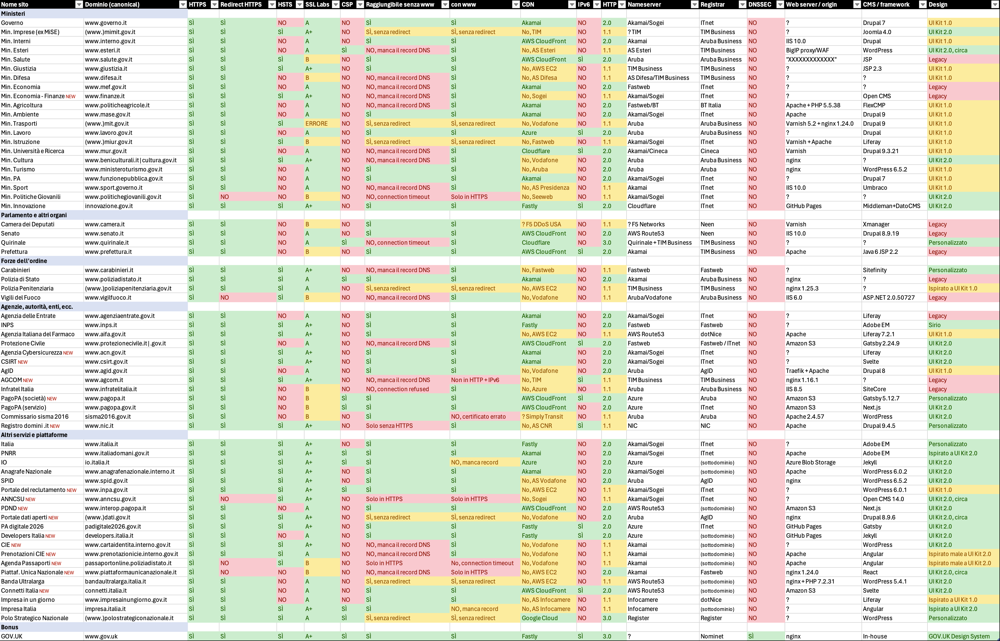
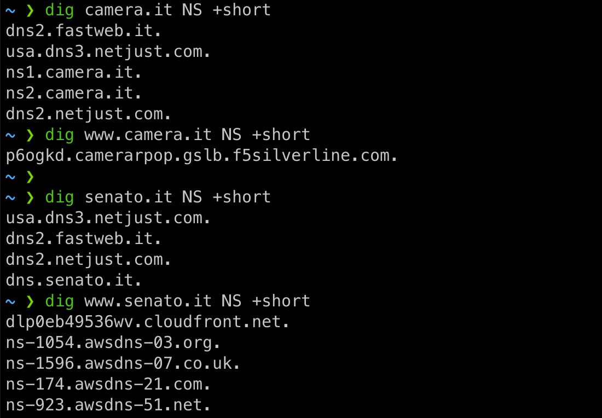

Questa è la terza edizione dell'**analisi dei siti web della pubblica amministrazione**. Trovate la prima edizione (febbraio 2022) [qua](https://forum.fibra.click/d/27650-analisi-configurazione-siti-web-pubblici-e-governativi), mentre la seconda (aprile 2023) [qua]().

Quest'anno ho analizzato **62 siti web** (+17) ed estratto i seguenti parametri di valutazione, spiegati meglio sotto:

- presenza di HTTPS
- redirect automatico da HTTP a HTTPS
- presenza di HSTS
- presenza di una Content Security Policy (CSP)
- grado di sicurezza SSL Labs
- raggiungibilità senza "www." e con "www."
- eventuale CDN utilizzata
- raggiungibilità con IPv6
- versione HTTP
- il provider del nameserver DNS del dominio **(nuovo)**
- il registrar presso cui è registrato il dominio **(nuovo)**
- presenza di DNSSEC **(nuovo)**
- web server utilizzato
- CMS utilizzato
- conformità alle linee guida di design per i servizi della pubblica amministrazione

Rispetto all'anno scorso ho rimosso il punteggio Lighthouse (un indice delle prestazioni del sito, spesso non molto indicativo e non deterministico).

*Clicca per ingrandire. Il foglio Excel originale si trova [qua](https://1drv.ms/x/s!AgJdWI23CtyPmr1F1RFDPOEBGoIovw).*

I dati sono stati raccolti il 21 e 22 aprile 2024, in parte con l'aiuto [di uno script](https://github.com/matteocontrini/analisi-siti-web-pa) e in parte manualmente (non tutto è facilmente automatizzabile). Potrebbero in entrambi i casi esserci degli errori.

---


*Ti interessa restare aggiornato su **digitalizzazione, Internet, AI**? Ogni settimana scrivo la newsletter [Storie di bit](https://storiedibit.it/?ref=blog), con le dieci storie più interessanti della settimana. È gratis, niente spam :)*


---

## Parametri di valutazione

*Se non ti interessano le spiegazioni, puoi saltare questa sezione e andare direttamente a [Le novità: cosa migliora e cosa peggiora](#le-novità-cosa-migliora-e-cosa-peggiora).*

#### • HTTPS

Se il sito web è accessibile e consultabile in HTTP over TLS (HTTPS). Deve esserlo.

#### • Redirect HTTP => HTTPS

Se accedendo al sito web in `http://` viene fatto un redirect automatico alla versione "sicura" `https://`. Deve essere così.

#### • HSTS

Se nella risposta del sito web in HTTPS è presente l'header `Strict-Transport-Security`, che serve ad indicare al browser che questo sito web dovrebbe essere raggiunto solo in HTTPS da quel momento in poi (semplificando un po'). È un sistema per prevenire gli attacchi *man in the middle* ma anche per evitare redirect inutili.

La presenza dell'header è ormai pratica consolidata da diversi anni.

#### • Grado SSL Labs

La valutazione del grado di sicurezza della configurazione SSL/TLS secondo https://www.ssllabs.com/ssltest/

Va dalla lettera A alla lettera F. Il sito restituisce un rapporto ovviamente molto più dettagliato.

Il grado ideale è A o B. Il grado B spesso indica che è attivo il supporto a TLS 1.0 e/o TLS 1.1, protocolli molto datati e ormai diffusamente sconsigliati (anche [dall'AgID stessa](https://www.agid.gov.it/it/sicurezza/tls-e-cipher-suite)). In alcuni casi potrebbe avere senso mantenerli attivi per compatibilità con dispositivi meno recenti, ma andrebbe fatto con consapevolezza e tenendo monitorato il traffico per ciascuna versione TLS, [come fa ad esempio](https://twitter.com/TheRealNooshu/status/1418741085501804544) il team dietro al sito del governo inglese.

La maggior parte delle CDN utilizza TLS 1.2+ come impostazione predefinita da ormai diversi anni.

#### • Content Security Policy (CSP)

Se è presente una Content Security Policy (CSP), come header o tag HTML. La CSP specifica alcuni criteri di sicurezza per limitare il tipo di contenuti che possono essere caricati nelle pagine (es. script, fogli di stile e font da quali domini, se è consentito JavaScript inline, ecc.).

Ho considerato CSP "valide" solo quelle un minimo articolate e che come minimo restringono le sorgenti degli script (`script-src`).

#### • Raggiungibilità con/senza www

Nella maggior parte dei casi è opportuno che un sito sia raggiungibile sia con il "prefisso" `www.` che senza. Ad esempio dovrebbero funzionare sia `esteri.it` che `www.esteri.it` (spoiler: non è così).

#### • CDN

Se il servizio è fornito con l'ausilio di una Content Delivery Network. È una scelta di solito saggia perché permette sia di sfruttare le funzionalità di caching e di accelerazione del sito web sia di proteggersi meglio dagli attacchi grazie a Web Application Firewall (WAF) e DDoS mitigation. Forse non tutti i siti web hanno bisogno di una CDN, ma se c'è è positivo.

#### • IPv6

Se il sito è accessibile tramite IPv6.

#### • Versione HTTP

La versione massima di HTTP supportata.

HTTP 2.0 è ampiamente supportato sia dai browser che dai server web ormai da qualche anno e ci si aspetta che sia abilitato.

HTTP 3.0 è invece standard solo dal 2022 e perciò non ancora pienamente supportato dai server web, ma sostanzialmente tutte le CDN lo supportano. Salvo casi particolari non c'è motivo per non abilitarlo.

#### • Nameserver

Il fornitore (o i fornitori) dei nameserver per la risoluzione DNS del dominio. È importante sia un servizio affidabile e ridondato, altrimenti ne può risentire la raggiungibilità del sito.

#### • Registrar

Il registrar presso cui il dominio è attualmente "registrato".

#### • DNSSEC

DNSSEC è un'estensione del DNS che aggiunge una firma crittografica ai record DNS. Permette ai resolver DNS di verificare che la risposta a una query DNS non sia stata manipolata in transito e che provenga effettivamente dal nameserver, prevenendo gli attacchi *man in the middle*.

Nel libro *Managing mission-critical domains and DNS*, Mark E. Jeftovic scrive che DNSSEC è specialmente importante nei casi di «DNS zones that provide a high-value target and where the consequences of successful and malicious tampering would be catastrophic, such as [...] payments gateways; public infrastructure, including health and safety; government organizations and units».

DNSSEC dovrebbe quindi essere abilitato su siti governativi o che gestiscono pagamenti (es. PagoPA).

#### • Web server/origin

Il server web utilizzato dal sito web (es. nginx). Non è sempre facilmente identificabile con precisione e in alcuni casi corrisponde al servizio utilizzato per l'hosting di siti web statici (es. Amazon S3). Non c'è una scelta corretta, è più per curiosità.

#### • Content Management System (CMS) / framework

Il CMS o il framework utilizzato dal sito web. Anche qua non c'è una scelta corretta, ma probabilmente usare Java 6 o .NET 2.0 (tecnologie di circa vent'anni fa) non è una buona idea.

#### • Design

Ho provato a categorizzare lo stile grafico dei siti web per capire quanto aderiscono alle [linee guida di design](https://designers.italia.it/) per i servizi pubblici di Designers Italia, gruppo di lavoro del Dipartimento per la Trasformazione Digitale.

Seppur l'aspetto grafico dei componenti non sia sufficiente da solo per definire quanto il sito sia conforme alle linee guida (il "manuale" prevede 15 passaggi di cui solo 2 riguardano la UI), è un utile indicatore della "modernità" del sito web e l'unico elemento valutabile in modo vagamente oggettivo. Se un sito web non segue nemmeno le linee guida per l'interfaccia grafica, è difficile credere che sia stato seguito come si deve l'intero processo di progettazione del sito.

I valori in particolare significano:

- **Legacy**: siti web che hanno un design precedente alle linee guida di design e che non è giustificato restino con un design vecchio.
- **UI Kit 1.0**: siti web che seguono il design system ufficiale ma nella versione iniziale, precedente al 2019 (es. https://www.governo.it).
- **UI Kit 2.0**: siti web che seguono il nuovo design system ufficiale pubblicato nel 2019. La distinzione tra 1.0 e 2.0 non è sempre chiara perché ogni sito fa un po' quello che gli pare mischiando le cose, ma quando ci sono elementi del kit 2.0 è abbastanza evidente (per esempio, notate il menù, i colori e i pulsanti su [https://padigitale2026.gov.it/](https://padigitale2026.gov.it/)). Esiste anche una terza generazione del design system ma è molto simile alla seconda.
- **Ispirato a...**: ci sono dei siti web che si ispirano al design system ufficiale riprendendo elementi come i colori e il font. Non è di per sé sbagliato ma considero al passo con i tempi solo i design ispirati al kit 2.0
- **Sirio**: è il design system dell'INPS, potrebbe sorprendere ma è davvero ottimo e molto curato (https://www.inps.design).
- **Personalizzato**: alcuni siti hanno un design che non segue le linee guida ma la scelta può essere giustificata. Vale ad esempio per siti promozionali (es. Italia.it) o di istituzioni particolari (es. il Quirinale). A differenza dei siti *legacy*, "non sanno di vecchio" e sono quantomeno responsive.

Nota: questa categorizzazione non è una scienza esatta e in alcuni casi è un po' soggettiva, quindi prendetela come una informazione indicativa.

---


*Leggi anche [**L'Italia dovrebbe copiare il portale GOV.UK**]()*


---

## Le novità: cosa migliora e cosa peggiora

- Cambiano alcune CDN:
  - `www.salute.gov.it` passa da Akamai a CloudFront. È la seconda CDN cambiata in due anni: l'anno scorso erano passati da Cloudflare ad Akamai. Con questo nuovo passaggio recuperano IPv6 ma non HTTP/3. Assurdamente il grado SSL passa da A+ a B perché invece che lasciare l'impostazione consigliata di CloudFront sono stati abilitati TLS 1.0 e 1.1. Spero ci sia un motivo
  - `www.lavoro.gov.it` passa da Neustar WAF/DDoS alla CDN Azure Front Door. L'anno scorso era passato da AS Vodafone al servizio Neustar, ma probabilmente era una soluzione temporanea. Con il passaggio guadagna sia IPv6 che HTTP/2
- Un sito che prima era senza CDN ora ce l'ha:
  - `www.mef.gov.it`, prima Fastweb, ora è dietro Akamai. La configurazione resta mezza rotta ma con la CDN guadagna HTTP/2
- Cambiano anche alcune infrastrutture di hosting:
  - `www.mimit.gov.it` (ex `www.mise.gov.it`) passa da BT Italia a TIM
  - `bandaultralarga.italia.it` passa da Aruba a AWS EC2
  - `www.spid.gov.it` passa da TIM Olivetti a Vodafone
  - `poliziapenitenziaria.gov.it` passa da AS Almaviva a una EC2 su AWS
- Quest'anno nessun sito ha tolto la CDN 🎉
- Il grado SSL Labs migliora per alcuni siti:
  - `www.carabinieri.it` passa da A ad A+ grazie a HSTS
  - anche `www.italiadomani.gov.it` passa da A ad A+, per un altro motivo che non ho identificato
  - `www.lavoro.gov.it`, `www.politicheagricole.it`, `www.ministeroturismo.gov.it`, `bandaultralarga.italia.it`, `www.impresainungiorno.gov.it` e `polostrategiconazionale.it` passano da B ad A (se usassero HSTS sarebbero A+)
  - `impresa.italia.it` infatti è passato da B ad A+
- Il grado SSL Labs peggiora per un paio di siti:
  - `www.esteri.it` perde inspiegabilmente HSTS e quindi il grado passa da A+ ad A
  - `www.salute.gov.it` da A+ a B perché hanno abilitato TLS 1.0/1.1 (vedi sopra)
  - dall'anno scorso nessun sito è più in grado C o inferiore
  - `www.mase.gov.it` ha rimosso HSTS, il grado resta A
- Entrano nel futuro (in aggiunta a quanto già indicato sopra):
  - `www.prefettura.it`, con IPv6 e HTTP/2 (CloudFront)
  - `www.poliziadistato.it` ora ha HTTP/2 (Akamai)
  - Bonus: `www.gov.uk` ora ha HTTP/3 (Fastly)
- Redirect e dintorni:
  - `www.politichegiovanili.gov.it` sente la vecchiaia. Era "perfetto" mentre ora è tutto spaccato: in HTTP non va più del tutto, mentre in HTTPS *solo* con il www
  - `www.mise.gov.it` ora è `www.mimit.gov.it`, funziona anche senza www ma il sito è "duplicato", non c'è una versione canonical
  - `www.difesa.it` ha rifatto il sito e a quanto pare hanno rotto *tutti* i link vecchi. La pagina 404 dice infatti "i contenuti che stai cercando sono stati trasferiti sul nuovo portale www.difesa.it"
  - `www.prefettura.it` ora è accessibile in HTTPS, l'anno scorso faceva redirect alla versione HTTP (!)
  - `www.infratelitalia.it` non mostra più la pagina della CGIL senza www ma invece dà connection refused
  - `bandaultralarga.italia.it` ora è accessibile con il www ma senza redirect (sito duplicato)
  - `www.impresainungiorno.gov.it` ora funziona senza www

## Le new entry

I seguenti siti sono stati analizzati per la prima volta: `www.finanze.it`, `www.acn.gov.it`, `www.csirt.gov.it`, `www.agcom.it`, `www.pagopa.it`, `www.nic.it`, `www.inpa.gov.it`, `www.anncsu.gov.it`, `www.interop.pagopa.it`, `dati.gov.it`, `www.cartaidentita.interno.gov.it`, `www.prenotazionicie.interno.gov.it`, `passaportonline.poliziadistato.it`, `www.piattaformaunicanazionale.it`, `connetti.italia.it`, `polostrategiconazionale.it`, `developers.italia.it`.

Non tutti se la cavano molto bene. Ad esempio:

- `www.agcom.it` ha IPv6 (incredibilmente fornito da TIM) ma è mezzo rotto: in HTTP ritorna un redirect insensato verso `https://131.1.252.188:443`
- `passaportonline.poliziadistato.it` funziona solo senza www, mentre `www.prenotazionicie.interno.gov.it` funziona solo con il www. Eppure sono la stessa piattaforma tecnica ma per due scopi diversi (CIE e passaporti)
- `www.piattaformaunicanazionale.it`, sito lanciato pochi mesi fa, non solo non funziona del tutto senza www ma anche con il www funziona solo in HTTPS. Di conseguenza non c'è nemmeno il redirect da HTTP a HTTPS

## I problemi che restano

- C'è ancora una straordinaria incoerenza nell'uso di `.gov.it` o `.it` come TLD/eTLD. Non è una questione superflua, anzi nasconde una grossa sottovalutazione del rischio di avere domini istituzionali senza un suffisso comune. Vi faccio una lista di domini, provate a indovinare per ciascuno qual è la versione che fa capo all'ente "corretto":
  - `esteri.it` o `esteri.gov.it`?
  - `interni.it`, `interno.it` o `interno.gov.it`?
  - `poliziapenitenziaria.it` o `poliziapenitenziaria.gov.it`?
  - `finanze.it` o `finanze.gov.it`?
  - `spid.it` o `spid.gov.it`?
  - `pagopa.it` o `pagopa.gov.it`?
  - `questura.it` o `questure.it`?
  - le risposte, in ordine: `esteri.it`; `interno.it` e `interno.gov.it`; `poliziapenitenziaria.gov.it`; `finanze.it`;  `spid.gov.it`; entrambi ma con siti diversi; nessuno dei due.
- Stesso caos anche tra domini con `www.` e senza. In alcuni casi il sito è accessibile solo con `www.`, in altri solo senza. In alcuni casi il sito è addirittura accessibile con entrambi ma senza redirect (cioè il sito è "duplicato")
  - Il fatto che che i browser spesso correggano in automatico il nome del dominio per aggirare configurazioni errate di questo tipo non è una giustificazione: resta il rischio che se scrivi `esteri.it` il sito non si apra perché non c'è il `www.`
  - Ci sono siti che funzionano per miracolo perché su quattro combinazioni (con/senza www in http/https) ne va solo una: è il caso di `https://www.piattaformaunicanazionale.it` (tutte le altre versioni sono rotte)
- Continuano ad esistere siti web identici su domini diversi, ad esempio `www.beniculturali.it` e `cultura.gov.it`
- Solo 34 siti su 62 supportano HTTP/2 (che risale al 2015), soltanto 3 siti supportano HTTP/3
- Solo 12 siti su 62 sono accessibili via IPv6
- La Content Security Policy è presente solo su 10 siti. Non ci siamo: è vero che configurare la CSP non è cosa banale, ma stiamo parlando dei siti web di un governo, non di un'associazione di volontariato
- C'è una grande varietà di CMS utilizzati. Su 62 siti ho rilevato almeno 21 CMS o tecnologie diverse utilizzate per realizzare i siti. Immagino che i team che sviluppano e gestiscono questi siti web siano indipendenti, perché altrimenti non avrebbe senso acquisire competenze su 21 CMS diversi
  - Non è proseguita l'avanzata di Adobe Experience Manager (3 siti), un CMS in cloud. I CMS più usati sono Drupal (11 siti) e WordPress (9 siti)
- Ci sono ancora siti realizzati con tecnologie ultra-obsolete: si intravedono IIS 6.0 (fine vita 2015), .NET 2.0 (fine vita 2011), PHP 5, Java 6 e JSP 2.2

## I nuovi problemi

- **0 domini su 62 supportano DNSSEC!**
- C'è una grande frammentazione nei nameserver usati per i domini. Per quasi il 40% è Akamai ma è spesso mischiato con altro in modo variabile (presumo in configurazione primario/secondario). La vetta si raggiunge con Camera e Senato che hanno una configurazione abbastanza creativa:

- Anche sui registrar c'è un po' di caos: i più usati sono ITnet (29%), Aruba (18%) e TIM Business (13%) ma si scopre che l'AgID stessa è un registrar accreditato dal NIC. E però su 62 siti solo 3 sono registrati tramite l'AgID. Viene da chiedersi a cosa serve avere un registrar "pubblico" se poi non viene usato.

## Le mostruosità

- Il sito del Ministero della Giustizia (`www.giustizia.it`) ha ancora questa Content Security Policy: `script-src 'unsafe-inline' 'unsafe-eval' * ;`. Qualche esperto mi confermerà che è equivalente a non impostare l'header del tutto.

- Il Ministero delle Salute (`www.salute.gov.it`) ha questo header in risposta a tutte le richieste: `Server: XXXXXXXXXXXXX`.

- Il sito Italia Domani (`www.italiadomani.gov.it`) aveva un video di 50 MB in homepage. È peggiorato! Adesso sono 80 MB per 47 secondi di video, cioè un bitrate medio di più di 13 Mbps per il video e tra 317 e 388 kbps per l'audio. È una follia! Quel video andava compresso l'altro ieri, si può almeno dimezzare senza perdita percepibile di qualità.

- `connetti.italia.it` blocca i motori di ricerca tramite il file `robots.txt`.

## Chi si salva

Se teniamo in considerazione l'intero insieme di criteri (discutibile ovviamente), **nessuno**.

Si salverebbe soltanto `www.gov.uk`, che ho messo non a caso come riferimento (il team GOV.UK è molto attento a questi aspetti).

Possiamo però iniziare ad allentare alcuni criteri e vedere cosa succede. Ad esempio due siti che si avvicinano alla "perfezione" sono `innovazione.gov.it` e `padigitale2016.gov.it` (entrambi open source, tra l'altro), togliendo i criteri CSP e DNSSEC.

Se invece togliamo IPv6 (🥲) e DNSSEC (oltre alla valutazione del design) restano `www.italiadomani.gov.it`, `www.poliziadistato.it` e `polostrategiconazionale.it`. Se pretendiamo HTTP/3 resta solo `polostrategiconazionale.it`, che però ha il difetto di non avere un redirect verso la versione www (o viceversa). E via dicendo.

Sarà per l'anno prossimo!

## Conclusioni

C'è ancora del lavoro da fare, diciamo.

Ma sarebbe già un primo passo se si rispettassero almeno le raccomandazioni dell'AgID, ad esempio quelle sulle [versioni di TLS e le cipher suite](https://www.agid.gov.it/it/sicurezza/tls-e-cipher-suite), secondo cui "i servizi esposti DEVONO utilizzare la versione TLS 1.2 o superiori e DOVREBBERO rifiutare versioni del protocollo inferiori". Questo non avviene in 13 siti analizzati (tra cui il Ministero della Difesa, ironicamente), e servirebbe quindi maggiore attenzione e controllo.

Sarebbe poi utile che queste raccomandazioni venissero estese ad altri aspetti: l'uso della eTLD `.gov.it` dovrebbe essere obbligatorio almeno per i nuovi siti (non è così, si veda la nuovissima `www.piattaformaunicanazionale.it`) e bisognerebbe avviare un percorso per allineare configurazioni e tecnologie al decennio corrente: HSTS, CSP, DNSSEC, IPv6 e HTTP/3 sono importanti, non va bene che siano optional da abilitare per caso e poi togliere l'anno dopo, come sta avvenendo.

Non mi sembra invece ci sia traccia del Polo Strategico Nazionale, il "cloud della pubblica amministrazione", oppure è indistinguibile rispetto a quello che si faceva prima.

All'anno prossimo!

---


*Ti interessa restare aggiornato su **digitalizzazione, Internet, AI**? Ogni settimana scrivo la newsletter [Storie di bit](https://storiedibit.it/?ref=blog), con le dieci storie più interessanti della settimana. È gratis, niente spam :)*


---
