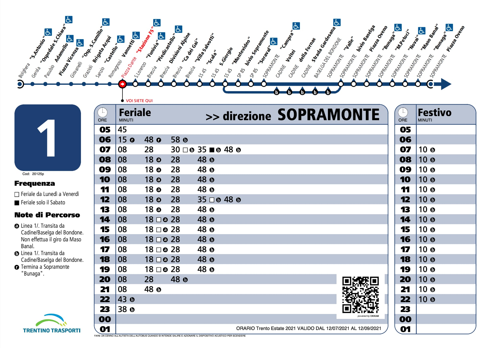
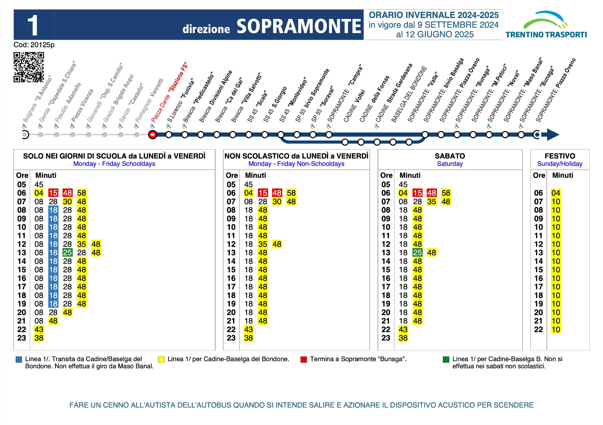
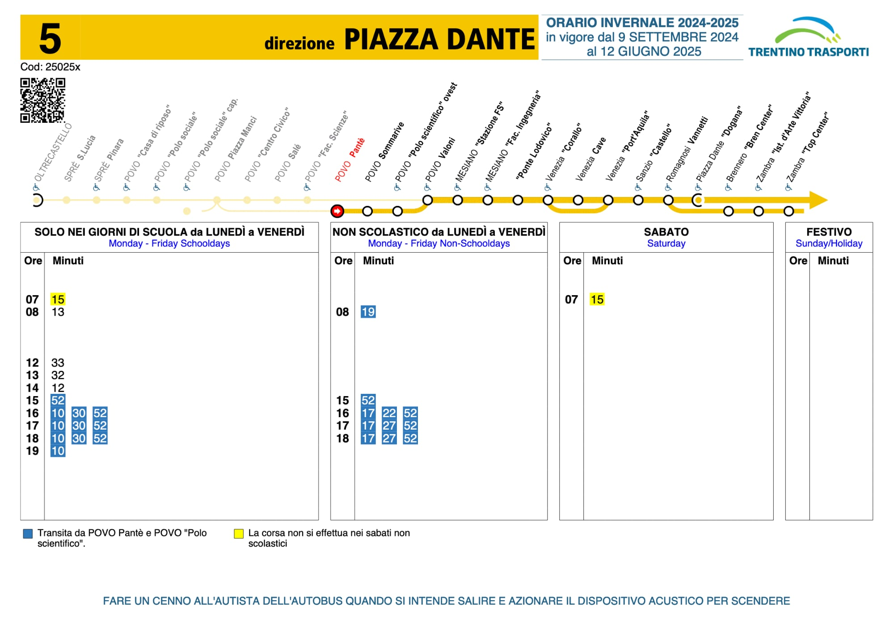
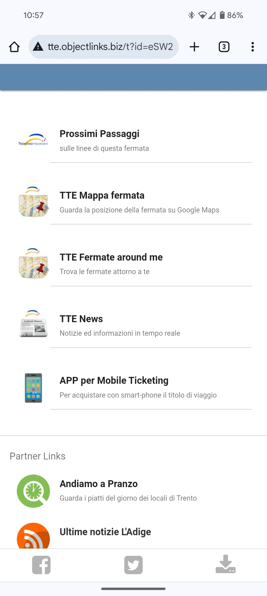
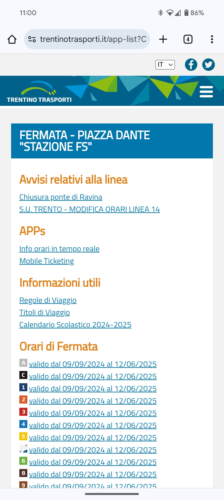
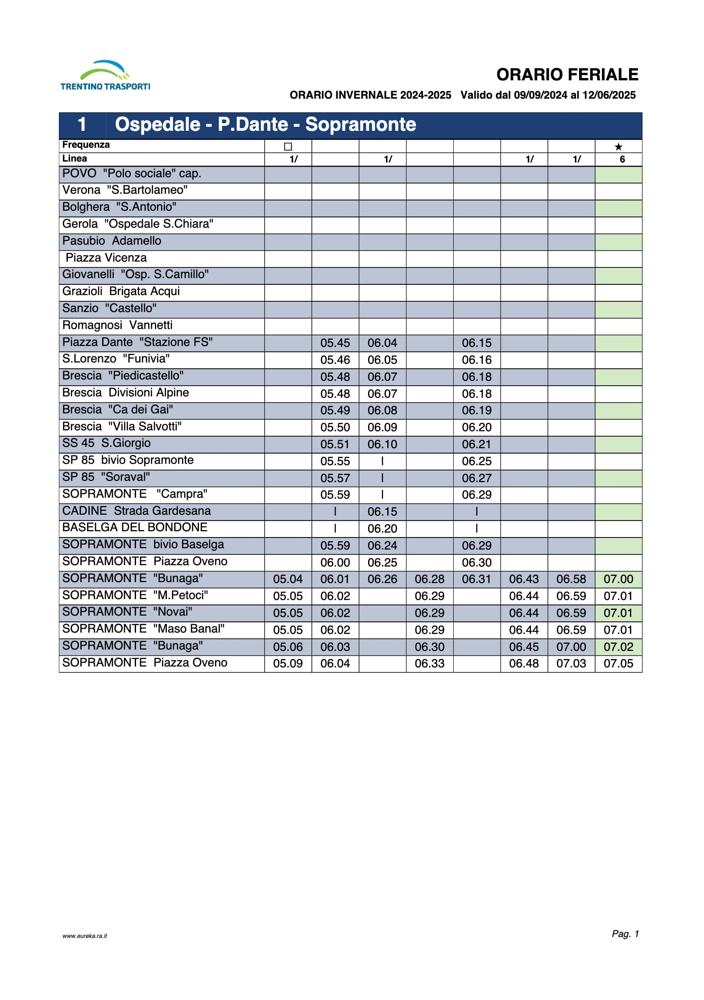

La [prima parte](/it/trentino-trasporti-digitale) di questa serie non era stata presa benissimo da tutti, come si può intuire scorrendola.

Purtroppo non è servita nemmeno come stimolo per fare meglio: in questi 20 mesi non ci sono stati progressi osservabili e tutto quello che ruota attorno ai servizi digitali è rimasto com'era. (Non è un segreto che il 9 settembre, primo giorno di scuola nonché giorno di sciopero, l'app per vedere i ritardi in tempo reale non funzionava.)

Il tema di questa seconda parte riguarda quindi le **nuove tabelle degli orari** di Trentino Trasporti, affisse alle fermate degli autobus urbani di Trento e Rovereto a partire dalla nuova stagione, e la controparte digitale a cui si accede tramite il **codice QR**.

Queste tabelle prima erano fatte così:

Adesso sono fatte così:

Vedete anche voi quello che vedo io? Sembra un **passo indietro dal punto di vista grafico**: si è passati da un design chiaramente studiato (e che sarebbe ancora abbastanza attuale) a quattro tabelle squadrate che **sembrano (o sono) fatte con Word, con i testi in Arial**.

Il senso è sicuramente rendere più facili da consultare gli orari: una volta individuata la colonna di interesse non serve stare a decifrare quadratini e simboletti vari per capire se quella corsa c'è oppure no quel giorno.

Ma ci sono alcuni problemi, che si vedono al volo:

- I testi delle ore/minuti sono più piccoli di prima (ma capisco che in alcuni casi lo spazio potrebbe diventare un problema).
- È più difficile seguire le righe perché non sono più di colore alternato come prima.
- Oltretutto quando le corse sono poche si creano questi enormi buchi bianchi 🤔:

- Il numero della linea (in alto a sinistra) è molto più piccolo e meno visibile. Anche il colore della linea è in generale meno visibile di prima, visto che non è più richiamato all'interno della tabella.
- La scelta dei titoli delle colonne è incomprensibile e lo si capisce guardando le traduzioni in inglese:
  - sono molto chiare le scritte ***"Monday - Friday Schooldays"*** e ***"Monday - Friday Non-Schooldays"***;
  - in italiano diventano ***"SOLO NEI GIORNI DI SCUOLA da LUNEDÌ a VENERDÌ"*** e ***"NON SCOLASTICO da LUNEDÌ a VENERDÌ"***;
  - era più naturale, coerente e anche più breve scrivere ***"LUNEDÌ - VENERDÌ solo SCOLASTICI"*** e ***"LUNEDÌ - VENERDÌ NON SCOLASTICI"*** (o varianti), magari evidenziando in qualche modo la differenza tra i due.
- Resta invariata nella sua assurdità la scritta in fondo alla pagina, dove si spiega di **"azionare il dispositivo acustico per scendere"**. Nessuno nel mondo reale ha mai detto "azionare il dispositivo acustico" per dire di premere il pulsante per prenotare la fermata. Quella cosa ha un nome: usiamolo, no? È un foglio degli orari, il suo scopo è farsi capire, non sfoggiare l'antilingua.

Una cosa positiva è che il **codice fermata** è messo più in risalto rispetto a prima: come avevo scritto nella prima parte, il codice potrebbe essere sfruttato per permettere di accedere velocemente alle informazioni di una fermata ben precisa. Tutt'ora però né il sito Trentino Trasporti né l'app permettono di filtrare per codice fermata.

---

**Scansionando il codice QR** si entra nel multiverso digitale di Trentino Trasporti. 🍿

(Ci sarebbe da notare che non c'è scritto a cosa serva il QR, facile pensare che sia un riferimento interno, come ho pensato anche io per anni.)

Con le vecchie tabelle, la pagina dove si veniva portati [era fatta così](http://tte.objectlinks.biz/t?id=eSW2):

In questo momento le voci di questa pagina non funzionano più (e non mi ricordo come funzionavano), ma almeno se ne intuisce l'utilità: "prossimi passaggi a questa fermata" suona promettente.

Ora invece è [così](https://www.trentinotrasporti.it/app-list?Cod_Nodo=20125p):

    
    

Sarò brutale ma questa pagina è **non solo inusabile ma completamente inutile**.

Si salva probabilmente solo la parte con gli **"Avvisi relativi alla linea"** (che linea? questa è la pagina di una fermata), che comunque porta a dei file PDF, con tutta la scomodità di scaricare e leggere dei PDF da uno smartphone.

Poi abbiamo le cosiddette **"APPs"**, tra cui **"Info orari in tempo reale"**. La logica sarebbe:
- ho appena scansionato un QR di una fermata e sono quindi stato geolocalizzato a una fermata;
- invece che mostrarmi subito quello che voglio sapere, cioè le prossime corse in arrivo, con i relativi [ritardi in tempo reale](https://traquantopassa.in/stazione), trovo solo un link per scaricare un'app;
- scarico e installo l'app, e del QR non me ne faccio più niente: devo trovare e selezionare a mano la fermata dove mi trovo per avere le informazioni di cui avevo bisogno 5 minuti prima e per le quali ero già stato appositamente localizzato.

Continuando nella pagina ci sono gli **"Orari di fermata"**, per ciascuna linea: poco chiaro a cosa dovrebbero servire, visto che a questa pagina ci si arriva scansionando un QR che si trova letteralmente stampato sugli orari di fermata, appunto.

Poi ci sono gli **"Orari di linea"**, che sono dei file PDF lunghi di solito diverse pagine, anche più di dieci. Fortunatamente da qualche anno sono almeno orientati verticalmente:

È senz'altro vero che in alcuni casi sia più comodo consultare queste tabelle, perché danno molte informazioni in un formato condensato, **ma perché fornirle in PDF**?

In Chrome per Android ad esempio i file devono essere per forza scaricati, è scomodo. (Il server di Trentino Trasporti poi non ha abilitata nessuna forma di compressione, ma per fortuna i PDF sono leggeri.)

Mi è bastata mezz'ora per realizzare un **prototipo di visualizzatore di questi PDF**: mostra tutte le pagine del PDF in una semplice pagina web, e scorre persino automaticamente alla pagina più vicina all'ora attuale!

<video style="width: 50%" controls>
    <source src="pdf-viewer.mp4" type="video/mp4">
</video>

---

È strana e per me incomprensibile questa difficoltà nel realizzare servizi digitali **pensandoli in modo che siano effettivamente comodi e utili** per le persone che dovranno usarli.

Quei codici QR alle fermate dovrebbero essere chiaramente evidenziati indicando **"Orari in tempo reale"**, dandogli priorità sul resto. Dovrebbero portare a una pagina web dove, per prima cosa, senza premere nulla e senza scaricare nulla, si veda un sommario dei problemi sulla linea, le prossime corse in arrivo con i minuti di attesa tenendo in considerazione i ritardi.

È l'unica cosa sensata da fare, ovvia a chiunque sia mai stato in attesa a una fermata dell'autobus.

Una cosa simile l'ho fatta io nel tempo libero ([Tra quanto passa](https://traquantopassa.in/)); come può non arrivarci un'azienda di trasporti che ragiona di trasporti tutti i giorni?

Per ora, un'altra occasione persa.

---

Per contattarmi, l'email è sulla homepage.
