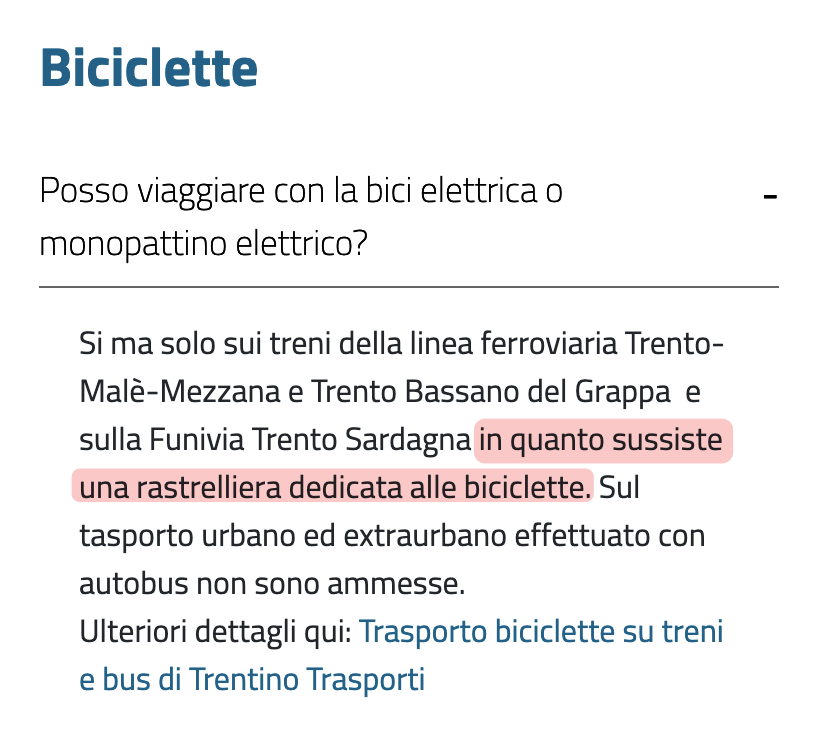
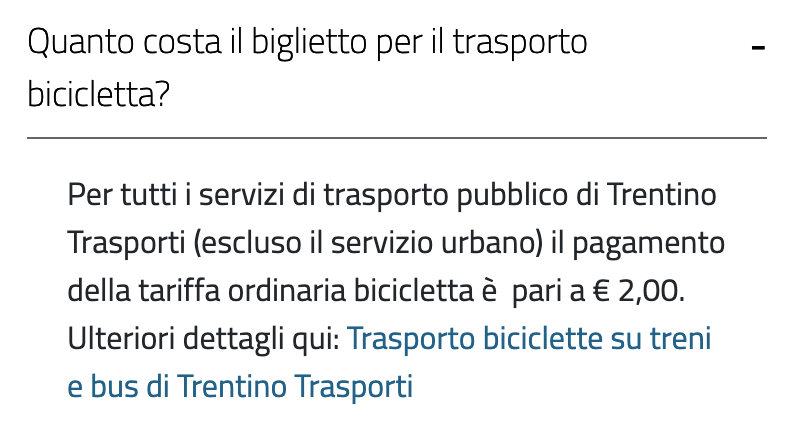
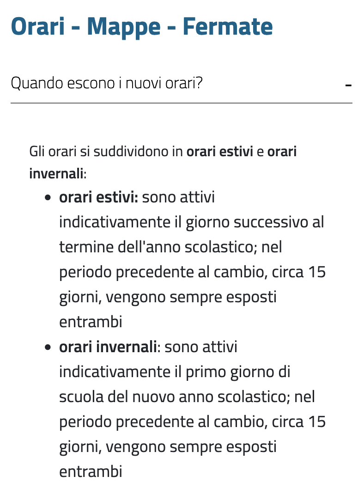
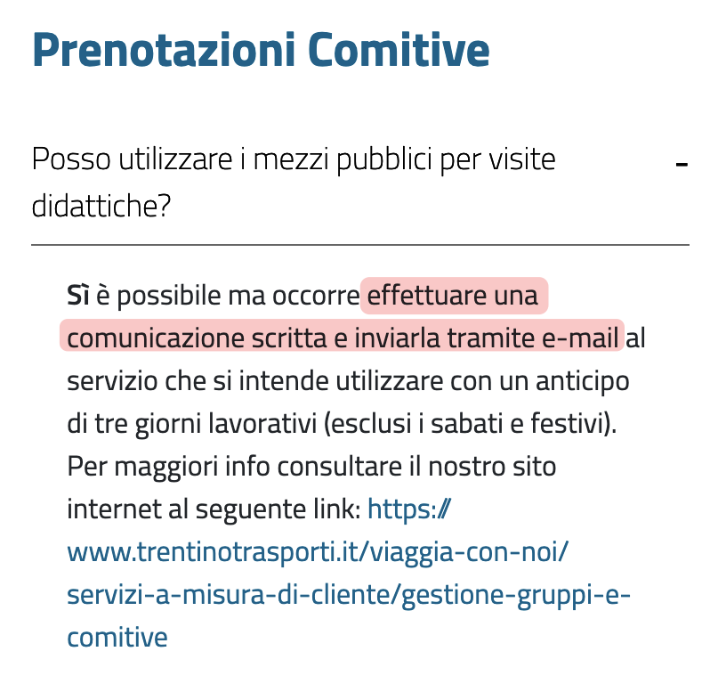

Fa parte di un servizio digitale (qua la [parte 1](/it/trentino-trasporti-digitale/) e qua la [parte 2](/it/trentino-trasporti-digitale-2/)) anche la **comunicazione**, specialmente nella pubblica amministrazione dove c'è l'abitudine a usare un linguaggio burocratico anche nelle comunicazioni al pubblico, spesso dimenticandosi che si sta parlando con delle persone.

Questa volta diamo quindi un'occhiata alla pagina [FAQ risposte in un clic](https://www.trentinotrasporti.it/it/servizio-clienti/faq) ([archivio](https://gist.github.com/matteocontrini/cd67215f17daecd99578cb4e28f539f9)) di Trentino Trasporti, una buona idea purtroppo realizzata in modo mediocre. I testi sono pieni di errori (ho contato almeno 9 errori di battitura e molti altri di sintassi) e sono scritti male, cioè di difficile comprensione.

Lo stile è troppo distante dalle indicazioni del [Manuale operativo di design](https://docs.italia.it/italia/designers-italia/manuale-operativo-design-docs/it/versione-corrente/doc/progettazione-dei-contenuti/scrittura-e-linguaggio.html#le-regole-per-un-linguaggio-semplice) dei servizi pubblici digitali, dai [fondamenti di linguaggio](https://designers.italia.it/design-system/fondamenti/linguaggio/) e dalla [Guida al linguaggio della Pubblica Amministrazione](https://docs.italia.it/italia/designers-italia/writing-toolkit/it/bozza/index.html), che sono i riferimenti ufficiali a livello nazionale.

Come riassume bene il manuale, l'obiettivo dovrebbe essere "scrivere per le persone" e "parlare la lingua delle persone per servizi più utili e accessibili".

Vediamo qualche esempio di **cosa non è la lingua delle persone**.

## Bici 🚲

Chiaro. Ieri sono andato al supermercato e purtroppo non ho potuto parcheggiare la bici in quanto non sussisteva una rastrelliera dedicata alle biciclette. Se suona ridicola, non è la lingua delle persone.

Come doveva essere:

>**Posso viaggiare con la bici elettrica o con il monopattino elettrico?**
>
>🚂 **Treni e funivia**: sì, su tutti i treni della ferrovia [...] ci sono le rastrelliere per appoggiare le bici e puoi quindi portare con te la bici elettrica o il monopattino elettrico.
>
>🚌 **Autobus**: no, sugli autobus, sia urbani che extraurbani, **non puoi** portare con te la bici elettrica o il monopattino elettrico.

(Non ho capito perché le bici elettriche hanno regole diverse da quelle normali, ma non importa.)

---

Il pagamento è pari a € 2,00, ma forse voleva dire "il costo". Suppongo poi che i 2 € siano in aggiunta al costo del biglietto personale (non lo so, non c'è scritto da nessuna parte).

In italiano si direbbe così:

>**Quanto costa trasportare la mia bicicletta?**
>
>Il trasporto della bicicletta costa 2 €, da pagare in aggiunta al costo del biglietto/abbonamento passeggero, ma se sei un turista è spesso gratis. [Verifica qui] i dettagli.
>
>**Attenzione:** il trasporto delle bici non è sempre ammesso e dipende dallo spazio disponibile. [Leggi qui] per i dettagli.

## Orari 🕑

A prima vista sembra accettabile, ma non lasciamoci confondere. Gli orari "escono"? Si "suddividono"? Perché mi fai risolvere un rebus anziché dirmi le date? E perché metà testo è ripetuto due volte?

Questa FAQ sarebbe utile se fosse scritta così:

>**Quando avverrà il passaggio da orario invernale a estivo?**
>
>❄️ L'**orario invernale** terminerà mercoledì 10 giugno 2026, l'ultimo giorno di scuola.
>
>☀️ L'**orario estivo** inizierà il giorno dopo, giovedì 11 giugno, e terminerà con l'inizio della scuola (la data non è ancora stata decisa).
>
>Nelle due settimane prima del cambio orario troverai affissi alle fermate sia l'orario estivo che invernale.

---

Qui non saprei da dove cominciare per commentare, quindi passiamo direttamente alla versione per le persone:

>**Come posso sapere se ci sono deviazioni delle linee degli autobus?**
>
>In presenza di cantieri, eventi sportivi, mercatini di Natale, ecc. alcune linee degli autobus potrebbero essere deviate e saltare delle fermate.
>
>Verifica se ci sono deviazioni:
>
>🚏 **Alle fermate**: presso tutte le fermate della linea deviata troverai affisso un cartello con le informazioni sulla deviazione.
>
>🪧 **Sul nostro sito**: [in questa pagina] trovi la lista delle deviazioni di autobus attualmente attive.
>
>📱 **Nell'app**: installa l'app Muoversi in Trentino per accedere rapidamente alla lista delle deviazioni per la linea o la fermata di cui hai bisogno.

## Biglietti 🎟️

Questa è incredibile. Perché usare perifrasi come "il personale viaggiante"? Poi, si può pagare solo con le banconote o anche con le monete? Perché mi parli dell'abolizione del sovrapprezzo, visto che il sovrapprezzo in realtà c'è?

Rivoluzioniamo:

>**Posso acquistare il biglietto a bordo degli autobus?**
>
>Sì, puoi acquistare il biglietto a bordo degli autobus urbani ed extraurbani rivolgendoti all'autista e pagando in contanti con monete o banconote.
>
>**Attenzione:** i biglietti acquistati a bordo costano di più. Per risparmiare, usa [le app], [la carta scalare] o vai in una biglietteria.
>
>🚌 **Autobus urbani**: il biglietto costa 2 € e vale solo per una corsa. Non puoi acquistare biglietti orari o giornalieri a bordo. Alcune linee urbane usano le tariffe extraurbane, [verificalo qui].
>
>⛰️ **Autobus extraurbani**: il costo del biglietto dipende dalla destinazione che vuoi raggiungere e ha un sovrapprezzo di 0,50 € se lo acquisti a bordo. Trovi i dettagli [in questa pagina].
>
>Se paghi con banconote, per favore usa il taglio più piccolo possibile. Esempio: se devi pagare 2 € usa una banconota da 5 € e non da 10 € o più.

Più chiaro no?

Bonus: **cosa c'è scritto sui cartelli alle fermate?** Che il sovrapprezzo è di 2 € (quello abolito!). Anche in questo caso con una sbrodolata di testo per lo più inutile e incomprensibile (la frase "nessuna giustificazione potrà essere addotta avverso la contestazione" si capisce solo a sentimento):

## Comitive 👬

Ok, devo "effettuare una comunicazione scritta" e poi "inviarla via email". Quindi devo comunicare la richiesta due volte? 🤔

In lingua umana:

>**Posso utilizzare i mezzi pubblici per visite didattiche?**
>
>Sì, ma devi inviare una richiesta di prenotazione via email almeno tre giorni lavorativi prima della data del viaggio. Trovi i dettagli e gli indirizzi email da contattare [in questa pagina].

## Bonus 🔈

Le [nuove tabelle degli orari (2024)](/it/trentino-trasporti-digitale-2) si presentano così:

E portano con sé anche in questo caso una lingua artificiosa e burocratica che nessuno parla. Perché scrivere "**azionare il dispositivo acustico per scendere**" anziché quello che dicono tutti, cioè "**premi il pulsante rosso per prenotare la fermata**"?

---

È così semplice. No?
