

Sono in corso le **Olimpiadi invernali Milano-Cortina**, che si svolgono in parte anche in Trentino, a Tesero e Predazzo (val di Fiemme). Per l'occasione sono stati finanziati diversi interventi legati al trasporto pubblico, tra cui il rinnovamento della stazione ferroviaria di Trento e il nuovo [hub intermodale di Cavalese](https://www.trentinotrasporti.it/it/news/inaugurazione-centro-intermodale-cavalese-per-il-progetto-brt) (bello).

**Trentino Trasporti** ha poi pubblicato una [sezione dedicata del sito](https://www.trentinotrasporti.it/it/viaggia-con-noi/olimpiadi-2026), tra l'altro rinnovato da poco, per illustrare le linee di autobus che si possono usare per raggiungere i luoghi delle gare.

Come se la sono cavata? Eh...

Per cominciare, la pagina iniziale a me fa un po' paura perché non capisco quale link devo cliccare per primo:

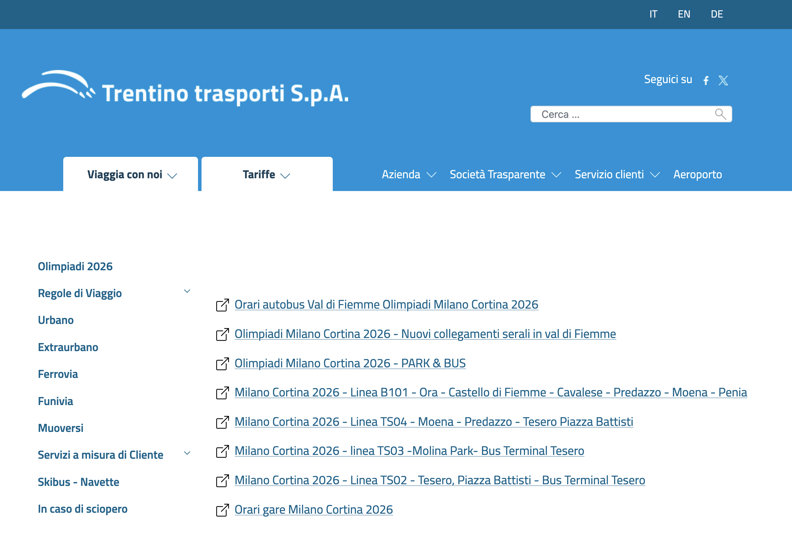

Scoprirò poi che tutti questi link in realtà sono linkati anche nelle altre pagine, è tutto un loop. O quasi, dato che due link ci sono solo qui, quindi bisogna risalire la corrente per ritrovarli. Le linee non sono tra l'altro nemmeno ordinate (TS04 → 03 → 02, mentre la medaglia d'oro non c'è).

Comunque, prendo il primo, [**Orari autobus Val di Fiemme Olimpiadi Milano Cortina 2026**](https://www.trentinotrasporti.it/it/viaggia-con-noi/olimpiadi-2026/orari-autobus-val-di-fiemme-olimpiadi-milano-cortina-2026).

C'è una lista di linee. Devo dire che non è molto chiaro come un visitatore dovrebbe capire quale linea è di suo interesse senza studiarle una alla volta.

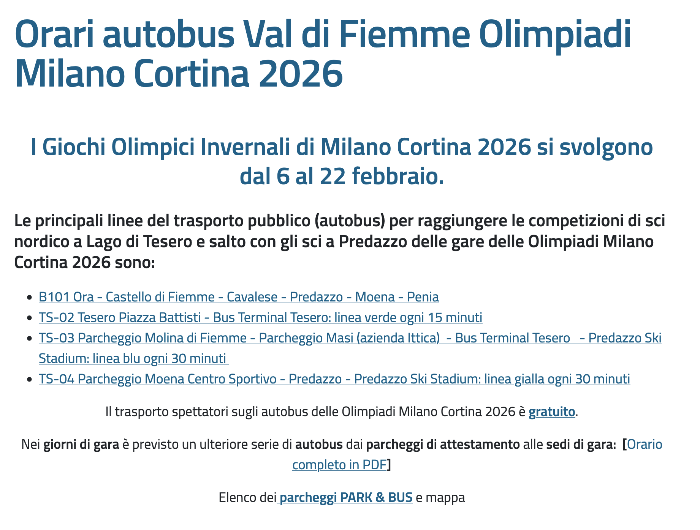

Prendiamo la prima: [**B101 Ora - Castello di Fiemme - Cavalese - Predazzo - Moena - Penia**](https://www.trentinotrasporti.it/it/viaggia-con-noi/olimpiadi-2026/milano-cortina-2026-linea-ts01-ora-castello-di-fiemme-cavalese-predazzo-moena-penia).

Secondo la [pagina extraurbano](https://www.trentinotrasporti.it/it/linea-extraurbana?idLineaAndata=1&idLineaRitorno=2&shift=0&idBacinoExt=L2l0L3ZpYWdnaWEtY29uLW5vaS9leHRyYXVyYmFuby8%3D&idBacinoBack=3) del sito Trentino Trasporti la linea B101 parte da Cavalese (val di Fiemme) e prosegue verso la val di Fassa fino a Canazei-Penia. Secondo la pagina Olimpiadi invece la linea B101 parte da Ora, che tra l'altro è più vicina a Bolzano che a Trento.

Come arrivo a Ora? Boh. La linea è stata variata per le Olimpiadi? Boh, non c'è scritto. Mi interessa qualcosa della val di Fassa? Non credo, non ci sono Olimpiadi in val di Fassa.

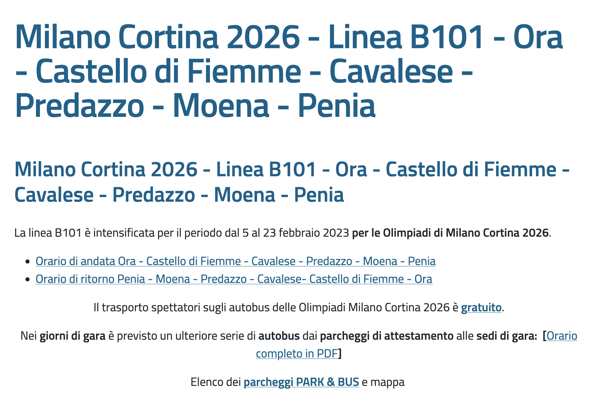

Gli orari comunque sono diversi da quelli "standard", quindi se vado nelle tabelle standard non trovo tutte le corse che invece esistono in questa tabella specifica per le Olimpiadi. La tabella è rigorosamente in **PDF ultra-wide** impossibile da consultare su mobile:

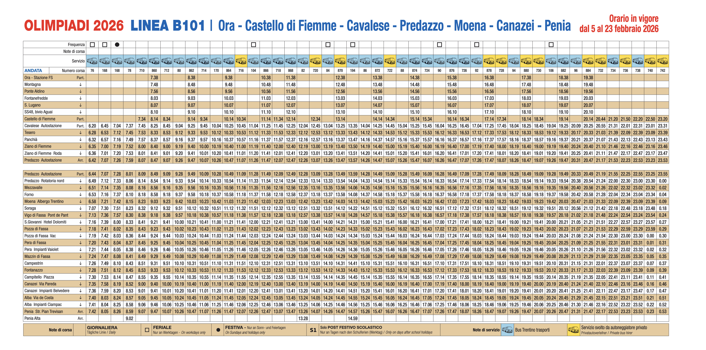

Next one: [**TS-02 Tesero Piazza Battisti - Bus Terminal Tesero: linea verde ogni 15 minuti**](https://www.trentinotrasporti.it/it/viaggia-con-noi/olimpiadi-2026/milano-cortina-2026-linea-ts02-tesero-piazza-battisti-hub-lago-di-tesero-localita-la-val). È una specie di navetta con frequenza 15 minuti interna a Tesero. Clicco:

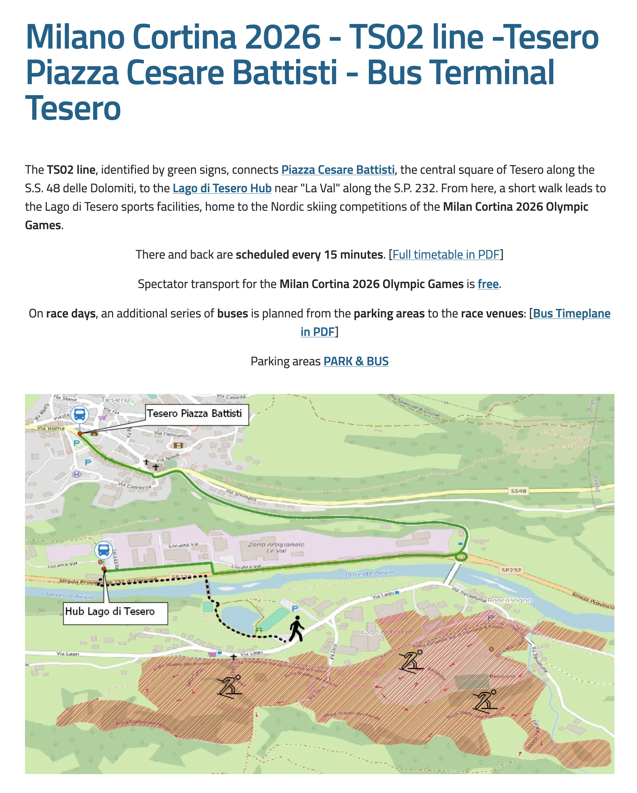

È improvvisamente **cambiata la lingua** in inglese, non si sa perché. Forse per farmi distrarre da questo **capolavoro di mappa**? Uno screenshot sgranato e schiacciato di OpenStreetMap su cui sono state disegnate figure e frecce presumibilmente con Word o PowerPoint, a giudicare dallo stile.

Proseguo e mi trovo questa tabella:

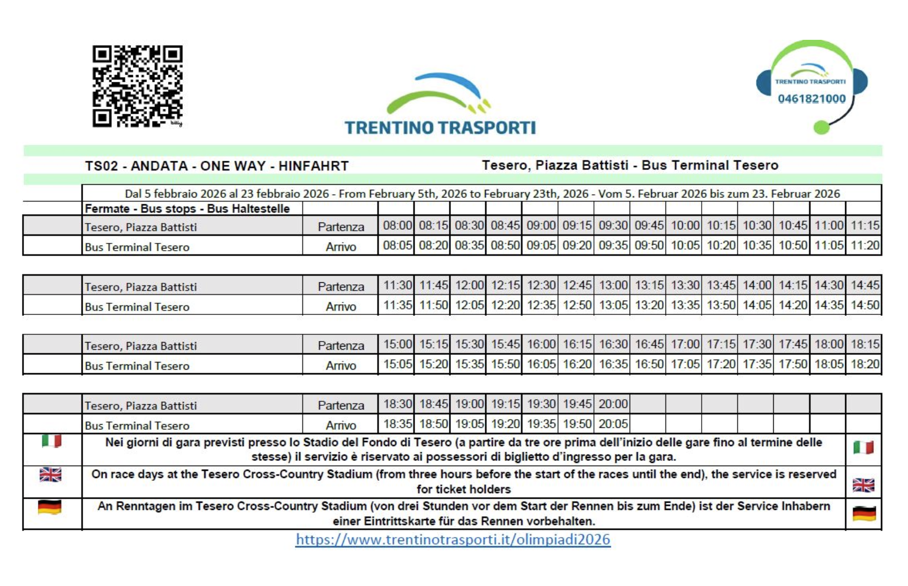

Ho dei dubbi sull'accessibilità visto che si presenta come uno **screenshot in JPEG di bassa qualità**, in questo caso probabilmente di Excel.

È tutto scritto in tre lingue, tranne "Partenza" e "Arrivo": per quelle bisogna arrangiarsi. Nella parte bassa c'è una sbrodolata di testo dove l'informazione più importante è tra parentesi. Il codice QR? Porta alla homepage olimpica di cui sopra. Coerenza con la tabella ultra-wide della B101 vista sopra? Scarsa. Senso di una tabella con un centinaio di celle per dire che l'autobus passa ogni 15 minuti? Probabilmente poco.

La [linea TS04](https://www.trentinotrasporti.it/it/viaggia-con-noi/olimpiadi-2026/milano-cortina-2026-linea-ts04-moena-predazzo-hub-lago-di-tesero-localita-la-val) invece collega un po' di parcheggi a Tesero. Ad esempio il "parcheggio del campo sportivo di Moena", che però nella mappa cambia nome e diventa "parcheggio auto Predazzo Bore", o qualche pixel più in là "piazzale delle Bore". Ho perso gli ultimi 10 minuti su Google Maps ad associare i nomi.

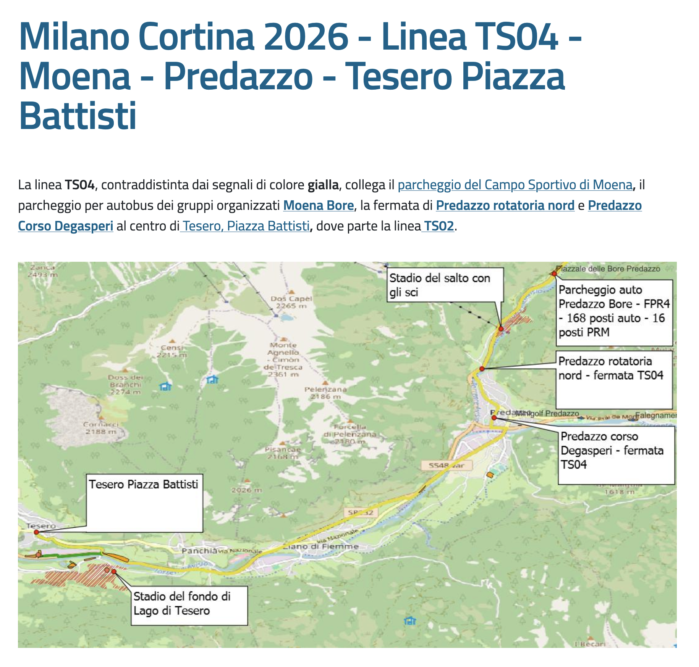

Segue l'orario della linea circolare:

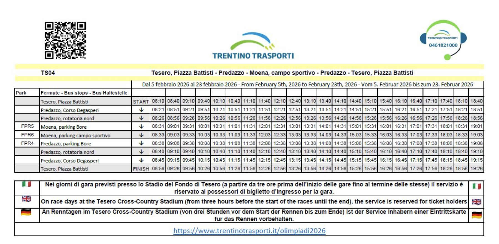

C'è una novità: partenza e arrivo ora si chiamano **"start"** e **"finish"**. Saetta McQueen.

C'è poi questa scritta magica:

>Nei **giorni di gara** è previsto un ulteriore serie di **autobus** dai **parcheggi di attestamento** alle **sedi di gara**: [[Orario completo in PDF](https://www.trentinotrasporti.it/images/allegati/olimpiadi2026/ORARI-AUTOBUS-GARE-OLIMPIADI-2026-VAL-DI-FIEMME.pdf)]

Wait a second, mi dici adesso che tutto quello che ho appena sfogliato in realtà era incompleto perché c'è *un ulteriore* (senza apostrofo) serie di autobus?

Apro il link. Scruto. Sai cosa? Mi sa che mi accontenterò di non aver capito:

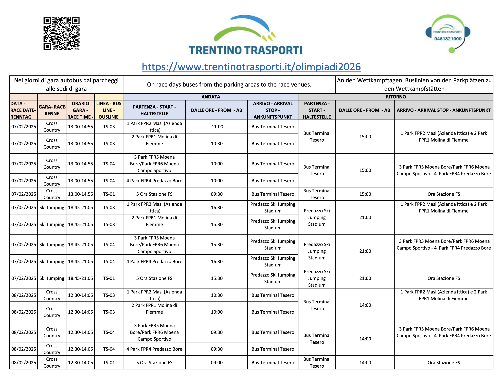

(Faccio solo notare che l'*arrivo* ha cambiato nome di nuovo e ora è *arrival stop*, mentre a questo giro bisogna arrangiarsi per *andata* e *ritorno*, non tradotti.)

Risalendo la corrente c'è anche questo link, [**Elenco dei parcheggi PARK & BUS e mappa**](https://www.trentinotrasporti.it/it/viaggia-con-noi/olimpiadi-2026/olimpiadi-milano-cortina-2026-parcheggi-di-attestamento), che porta a questa pagina dove ovviamente non c'è alcuna mappa:

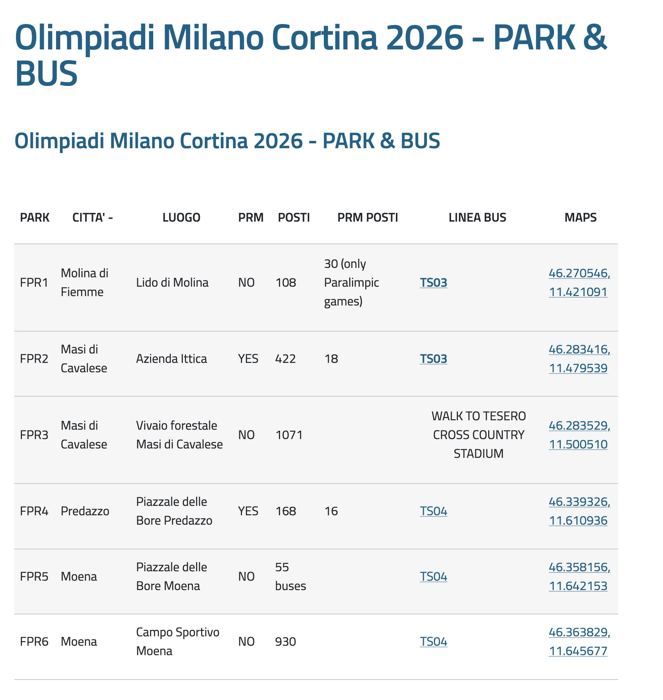

Però scopro che alcuni *park* in alcune *città* hanno il **PRM**. Altre non ce l'hanno, il PRM. Cos'è il PRM? Chi lo sa.

Quanti *posti* ha il parcheggio Moena Bore? *55 buses* (ma non era un parcheggio auto?). Quanti *PRM posti* ha? Cella vuota.

Continuo a risalire la corrente e scopro un universo parallelo che mi ero fin qui perso, cioè **gli orari serali!** C'è una pagina separata dove tutto quello che avete imparato finora non serve più a niente, perché ora bisogna capire cosa sono e a cosa servono altre 6 linee, di cui due in grassetto (non so se è rilevante, nel dubbio...):

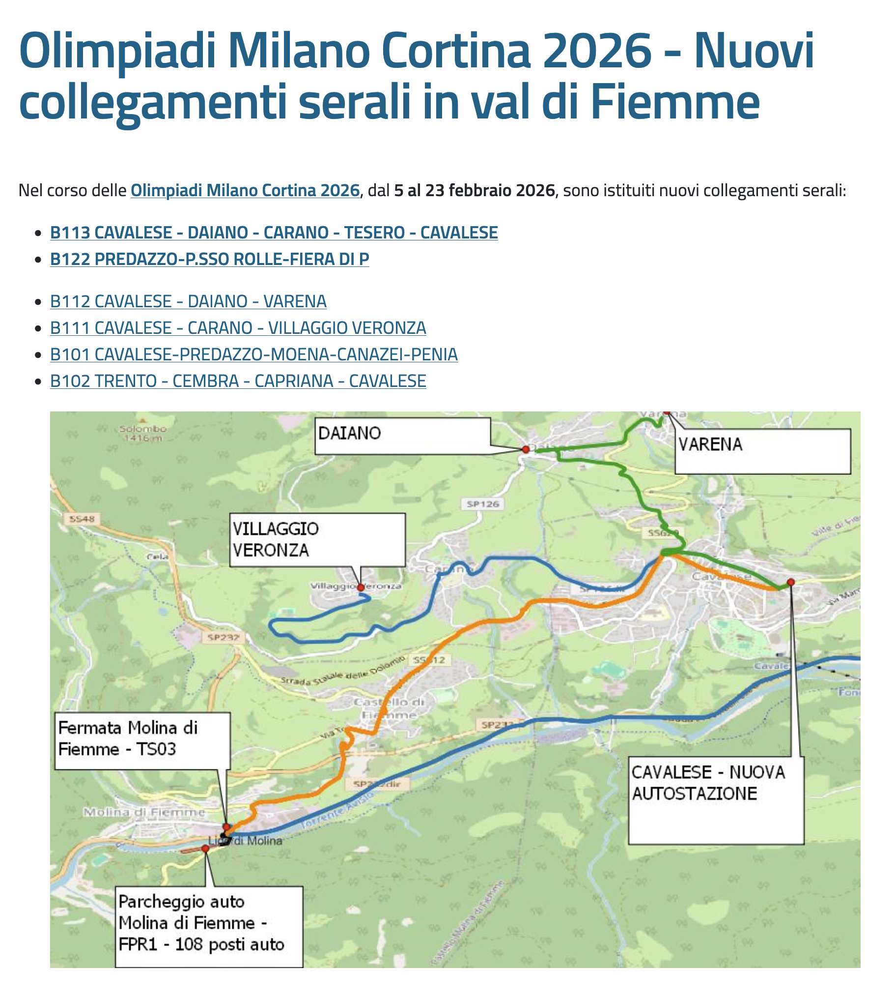

Ad esempio la **linea B113**, che parte da Cavalese (*nuova autostazione*, ma non si chiamava orgogliosamente *hub intermodale*?), gira un po' di paesi e torna indietro. La apro giusto per vedere, mi aspetto una tabella come quelle di prima:

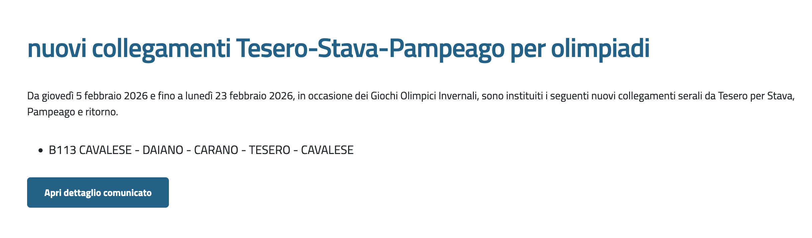

Uhm... scopro invece che sono *instituiti* (con la *n*) nuovi collegamenti tra Tesero e Pampeago. Pampeago? Boh, ok. Comunque, si presentano così:

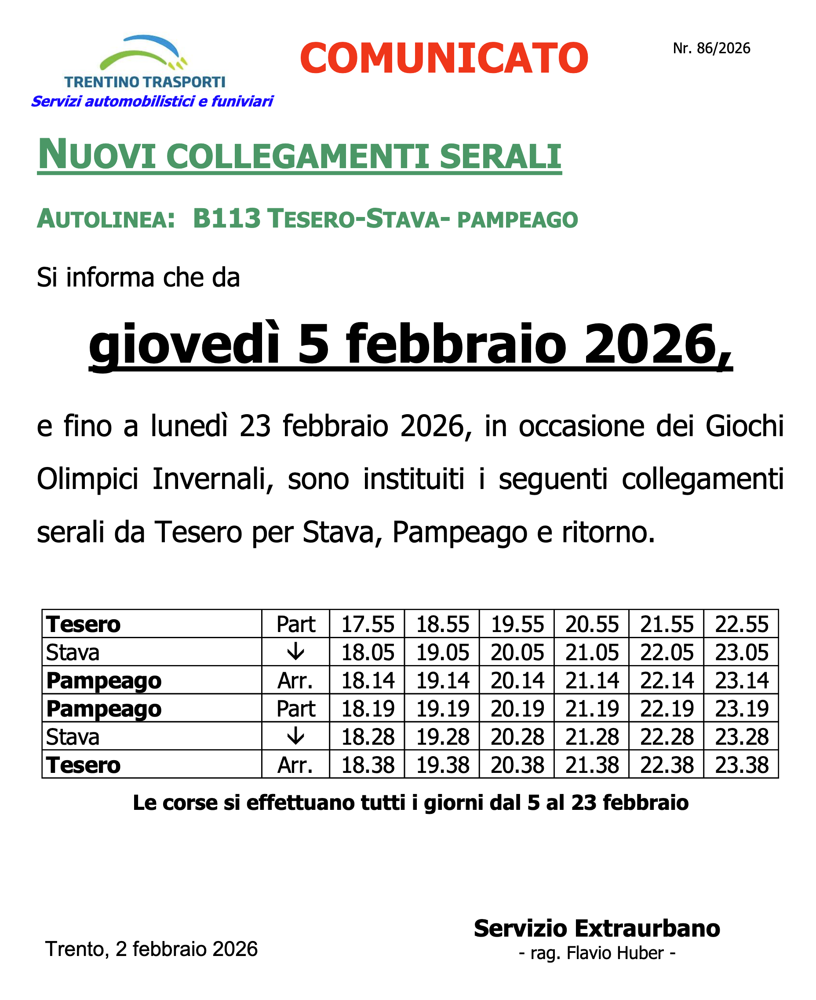

Io invece mi presento così:

Ma non è finita, perché nel momento in cui si cambia la lingua del sito da italiano a inglese si apre un universo parallelo. Qui le paralimpiadi si chiamano *Paralimpic games* (senza *y*) e le corse degli autobus *courses*. Come quelli dell'università.

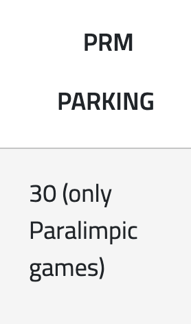

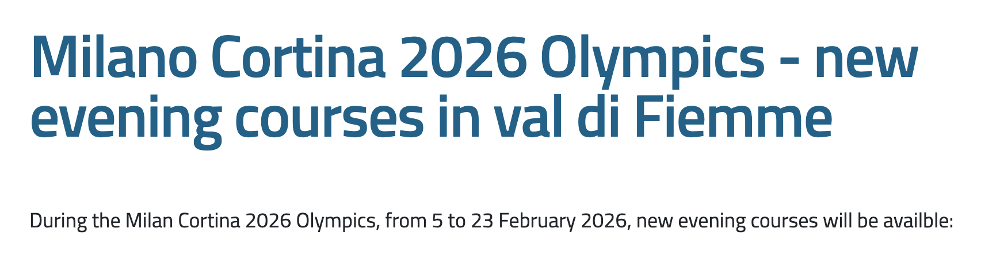

La pagina con la lista dei parcheggi invece si presenta così. Pure multilingua.

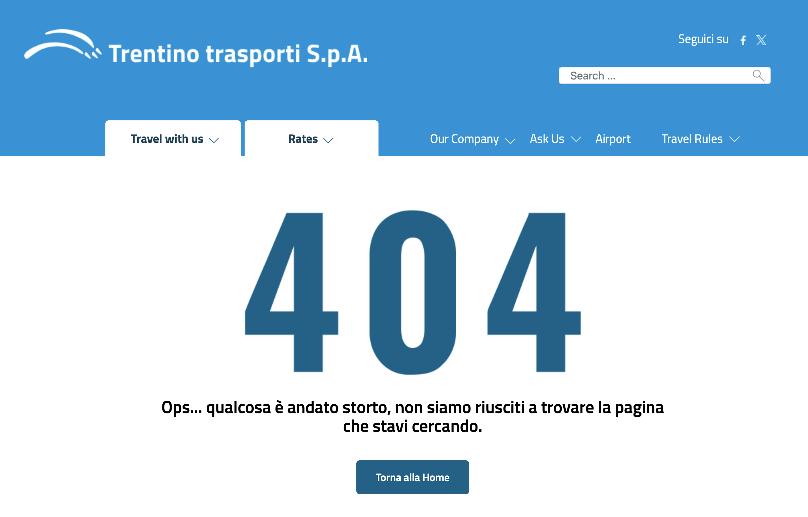

---

Forse non ci si poteva aspettare tanto di più, visti i capitoli precedenti di questa serie.

Ma queste sono le Olimpiadi. In Trentino. Capiterà ancora in questo secolo? Chi lo sa. Gli orari in Excel, le mappe pasticciate su PowerPoint, le tabelle incomprensibili, i link rotti e le traduzioni maccheroniche... Quand'è che si è smesso di [fare le cose bene](https://web.archive.org/web/20091218055902/http://mappery.com/map-of/Trento-Bus-Route-Map-Italian)?
